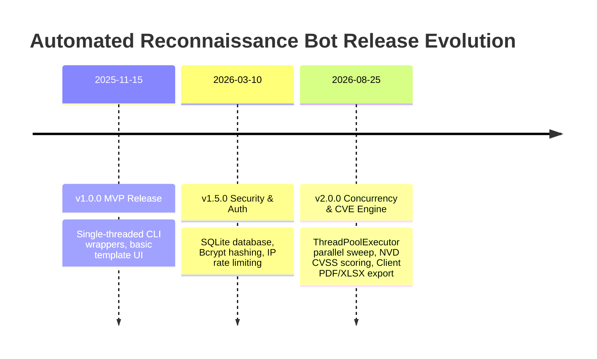

# Changelog

All notable changes to the **Automated Reconnaissance Bot** platform will be documented in this file.

The format is based on [Keep a Changelog](https://keepachangelog.com/en/1.0.0/), and this project adheres to [Semantic Versioning](https://semver.org/spec/v2.0.0.html).

---

## Changelog Purpose
This document provides a transparent, chronological ledger of all functional additions, security hardenings, architectural refactorings, bug fixes, and breaking changes introduced across official releases of the Automated Reconnaissance Bot platform.

---

## Versioning Convention
The Automated Reconnaissance Bot follows the `MAJOR.MINOR.PATCH` semantic versioning scheme:
- **`MAJOR` (x.0.0):** Incompatible API changes, major architectural redesigns, or breaking database modifications.
- **`MINOR` (0.x.0):** New scanning modules, enhanced reporting capabilities, or backward-compatible feature additions.
- **`PATCH` (0.0.x):** Backward-compatible bug fixes, security patches, or performance optimizations.

---

## Release History

---

## [2.0.0] - 2026-08-25

### Added
- **Multi-Threaded Parallel Execution:** Integrated Python `concurrent.futures.ThreadPoolExecutor` in `main.py` allowing all 8 scanning modules to run simultaneously during "All Scans".
- **Automated NVD CVE Cross-Referencing:** Implemented automated querying of the National Vulnerability Database API via `nvdlib` to enrich detected Nmap service versions with CVSS v3.1 base scores and severity tiers (Critical, High, Medium, Low).
- **Client-Side Export Engine:** Integrated SheetJS (`xlsx.full.min.js`) and jsPDF (`jspdf.umd.min.js` + `jspdf.plugin.autotable.min.js`) for one-click browser-side compilation of PDF audit reports and multi-sheet Excel workbooks.
- **UDP Port Scanner Module (`udp_logic.py`):** Added high-speed `-sU -Pn` UDP port assessment for core administrative services (DNS, SNMP, NTP, DHCP, TFTP, IKE).
- **Comprehensive Documentation Suite:** Formulated standard IEEE 830 SRS, PRD, System Architecture, UI/UX Design System, Developer Guide, and Testing Specifications in `docs/`.

### Changed
- **Target Normalization Engine:** Refactored `normalize_target()` to perform thread-safe Reverse DNS resolution on bare IP addresses without modifying global socket timeouts.
- **Scan Type Canonicalization:** Implemented `get_canonical_type()` to map all user inputs, aliases, and whitespace variants to unified internal keys for deterministic caching.
- **Frontend Dashboard Architecture:** Upgraded `templates/index.html` to dynamic responsive dark/light layouts with real-time execution duration timers (`MM:SS`).

### Fixed
- **Thread Blocking during Subprocess Calls:** Fixed issue where synchronous CLI subprocess executions blocked FastAPI's ASGI event loop by executing them inside worker thread pools.
- **crt.sh Public API Timeouts:** Implemented automated retry backoff and secondary failover to HackerTarget API when `crt.sh` returns HTTP 503 or 504 errors.
- **Wayback Static Asset Noise:** Enhanced regex filters in `waybackmachine.py` to strip over 20 static file extensions (`.png`, `.css`, `.woff`, `.svg`) and classify remaining endpoints into API vs Sensitive categories.

### Security
- **Bcrypt Password Architecture:** Completed transition to Bcrypt hashing (`bcrypt.gensalt()`) with automatic, on-the-fly migration of legacy SHA-256 password records.
- **Input Allowlist Hardening:** Enforced strict regex matching (`VALID_TARGET_RE`) preventing command injection and rejecting shell metacharacters (`;`, `&`, `|`, `` ` ``, `$`).
- **Persistent Session HMAC Key:** Auto-generated dynamic 64-character hex secret persisted in `.session_key` with `SameSite=Lax` and `HttpOnly` cookie flags.
- **Brute-Force Sliding-Window Rate Limiting:** Enforced strict block of 5 failed login attempts per 60-second window per client IP.

### Breaking Changes
- **Direct Entry Point Deprecation:** Executing `python main.py` directly is now deprecated and disabled for web serving. All traffic must enter through `python login_app/app.py`.

### Migration Notes
- Existing SQLite databases from v1.x (`users.db`) will automatically upgrade password records from SHA-256 to Bcrypt upon the user's first successful login.

### Known Issues
- Network UDP scanning and Nmap stealth SYN scanning require elevated host permissions (Administrator / root).
- Target hosts that explicitly drop ICMP Echo requests may report as "Host not Reachable" in pre-scan aliveness probes.

### Upcoming Changes (v3.0.0 Roadmap)
- Real-time line-by-line terminal output streaming via WebSockets and Server-Sent Events (SSE).
- Distributed Celery and Redis worker queues for multi-node attack surface scanning.

---

## [1.5.0] - 2026-03-10

### Added
- **SQLite Access Control (`login_app/users.db`):** Replaced hardcoded credentials with local relational SQLite database storage.
- **Out-of-Band CLI User Provisioning (`login_app/add_user.py`):** Created secure interactive command-line utility for adding operators.
- **5-Day Local Filesystem Cache (`scan_data/`):** Added automated JSON caching preventing redundant network scans on recurring targets.
- **Automated Cache Purge:** Added `cleanup_old_scans()` to automatically delete scan cache files older than 5 days.

### Changed
- **FastAPI Routing Architecture:** Separated authentication gateway (`login_app/app.py`) from core reconnaissance API router (`main.py`).

### Security
- Added in-memory rate limiting to the `/login` endpoint.
- Enforced session cookie encryption using Starlette's `SessionMiddleware`.

---

## [1.0.0] - 2025-11-15

### Added
- **Initial Module Suite:**
  - `whois_scanner.py`: RDAP and WHOIS domain registry lookup.
  - `geoiplookup.py`: IP geolocation resolver.
  - `shodan_tool.py`: HTTPS Strict-Transport-Security presence and strength checker.
  - `hosting_detector.py`: Cloud provider identification for AWS, GCP, Azure, and Cloudflare.
  - `subdomain_logic.py`: Certificate Transparency subdomain harvesting.
  - `wappalyzer_scan.py`: Technology stack and CMS profiling.
  - `search_logic.py`: Google Dork generation and `robots.txt` scraper.
  - `email_logic.py`: Public email and corporate name scraper.
  - `network_logic.py`: Nmap TCP port and service scanner.
  - `webanalysis_logic.py`: Perl-based Nikto web server configuration auditor.
- **Web UI:** Initial Jinja2 HTML layout with Bootstrap 5 styling.
