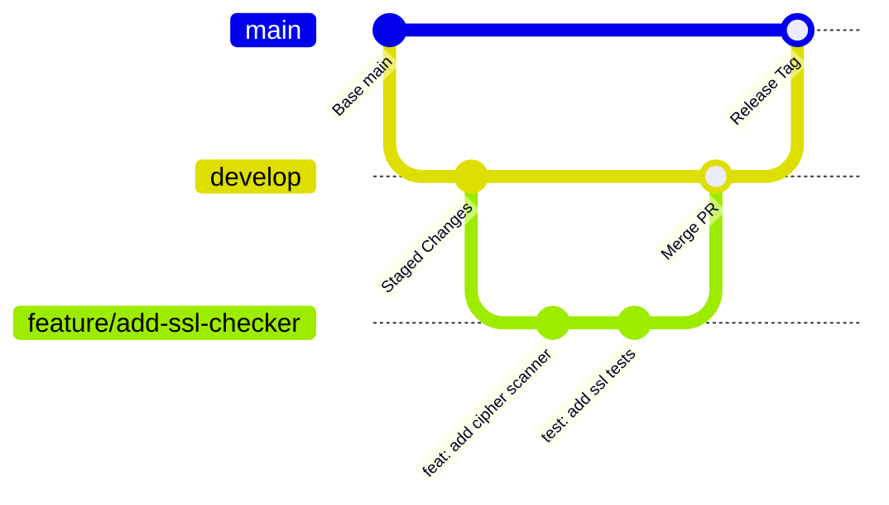

# Contributing to Automated Reconnaissance Bot

Thank you for your interest in contributing to the **Automated Reconnaissance Bot**! We welcome contributions from developers, penetration testers, security researchers, and documentation writers.

---

## Code of Conduct

We are committed to providing a welcoming, inclusive, and harassment-free experience for everyone. 

### Our Standards
- **Respect and Professionalism:** Treat all community members and contributors with empathy and respect.
- **Constructive Feedback:** Provide objective, actionable feedback during code reviews and issue discussions.
- **Ethical Focus:** The Automated Reconnaissance Bot is designed strictly for authorized, defensive security research and penetration testing. Contributions that facilitate malicious exploitation or denial-of-service will be rejected immediately.

---

## Project Overview
The Automated Reconnaissance Bot is a hardened, modular monolith built on FastAPI, Uvicorn, SQLite, and Python's `ThreadPoolExecutor`. It orchestrates underlying OS security tools (Nmap, Perl Nikto) and public intelligence APIs into a unified attack surface management dashboard.

---

## Prerequisites & Development Environment

Before contributing, ensure your development machine meets these requirements:

| Tool | Minimum Version | Installation Guidance |
| :--- | :--- | :--- |
| **Python** | 3.8+ (Recommended 3.10–3.12) | [python.org](https://www.python.org/downloads/) |
| **Nmap** | 7.80+ | [nmap.org/download.html](https://nmap.org/download.html) |
| **Perl** | 5.30+ | **Windows:** [Strawberry Perl](https://strawberryperl.com/)<br>**Linux:** `sudo apt install perl` |
| **Git** | 2.30+ | [git-scm.com](https://git-scm.com/) |

---

## Repository Setup & Installation

### Step 1: Fork and Clone the Repository
```bash
git clone https://github.com/<your-username>/Automated-Reconnaissance-Bot.git
cd Automated-Reconnaissance-Bot/Source_Code
```

### Step 2: Configure Virtual Environment
**Windows:**
```powershell
python -m venv venv
.\venv\Scripts\activate
```

**Linux / macOS:**
```bash
python3 -m venv venv
source venv/bin/activate
```

### Step 3: Install Dependencies & Development Tools
```bash
pip install --upgrade pip setuptools wheel
pip install -r requirements.txt
pip install pytest pytest-asyncio flake8 black bandit responses
```

---

## Configuration & Environment Variables

| Variable | Type | Default | Description |
| :--- | :--- | :--- | :--- |
| `SESSION_SECRET_KEY` | String | `.session_key` | Dynamic 64-char hex key used for HMAC session cookie signing. |
| `PORT` | Integer | `8000` | Local port for FastAPI web server. |

---

## Project Structure

```
Automated-Reconnaissance-Bot/Source_Code/
│
├── docs/                                # Project Documentation Suite (PRD, SRS, etc.)
├── login_app/                           # Authentication Gateway (:8000)
│   ├── add_user.py                      # CLI User Provisioner
│   ├── app.py                           # Application Gateway Entry Point
│   ├── users.db                         # SQLite User Database
│   └── templates/                       # Auth Templates (landing.html, login.html)
├── nikto-master/                        # Embedded Perl Nikto Web Scanner
├── scan_data/                           # Automated Local Cache Storage
├── templates/                           # Dashboard Frontend (index.html)
├── tests/                               # Automated Test Suite (pytest)
├── CHANGELOG.md                         # Version Changelog
├── CONTRIBUTING.md                      # Developer Guidelines (This File)
├── README.md                            # Main Repository README
└── main.py                              # Core Orchestrator & Concurrency Router
```

---

## Git Workflow & Branching Strategy



### Branch Naming Conventions
- `feature/<short-description>` (e.g. `feature/subdomain-takeover-alerts`)
- `bugfix/<issue-number>-<short-description>` (e.g. `bugfix/42-crtsh-timeout`)
- `docs/<short-description>` (e.g. `docs/update-architecture-diagrams`)
- `refactor/<short-description>` (e.g. `refactor/threadpool-exception-handling`)

### Commit Message Conventions
Follow [Conventional Commits](https://www.conventionalcommits.org/en/v1.0.0/):
- `feat: add automated NVD CVSS scoring for detected services`
- `fix: resolve crt.sh 504 gateway timeout with HackerTarget fallback`
- `docs: update SRS requirement FR-09 for NVD integration`
- `test: add unit tests for input regex sanitization`
- `refactor: optimize JSON cache lookup in main.py`

---

## Issue Reporting & Pull Requests

### Bug Reports
When reporting a bug, please include:
1. Clear description of expected vs actual behavior.
2. Exact target format tested (redacting sensitive private domains).
3. Operating system version and terminal log output / tracebacks.
4. Python, Nmap, and Perl version numbers.

### Feature Requests
Feature proposals should align with our core objectives: rapid reconnaissance, accurate fingerprinting, and non-destructive assessment.

### Pull Request Requirements
1. **Target Branch:** All pull requests must be opened against the `develop` branch (never directly against `main`).
2. **Test Coverage:** New features or bug fixes must include corresponding `pytest` unit/integration tests.
3. **Linting & Formatting:** Code must pass `black` and `flake8` checks without warnings.
4. **Documentation:** Any modified API endpoints or user workflows must be updated in `docs/` and `CHANGELOG.md`.

---

## Coding Standards & Code Formatting

### Python Code Style (PEP 8)
- Maximum line length: **100 characters**.
- Auto-format your code using `black -l 100 .`.
- Verify static typing with explicit type hints.

### Subprocess & OS Command Safety Rules
> [!CAUTION]
> **STRICT SECURITY RULE:** Never pass `shell=True` or use `os.system()`.  
> Always execute commands via tokenized argument lists:
```python
# CORRECT & SECURE
subprocess.run(["nmap", "-sV", "-p", "80,443", target], check=True, stdout=subprocess.PIPE)

# INSECURE - INSTANT PR REJECTION
# subprocess.run(f"nmap -sV -p 80,443 {target}", shell=True)
```

---

## Testing & Quality Assurance

Run all test suites before submitting a PR:

```bash
# Run pytest test suite
pytest tests/ -v --tb=short

# Run Bandit security linter
bandit -r . -x ./venv,./nikto-master

# Run Flake8 static analysis
flake8 . --count --select=E9,F63,F7,F82 --show-source --statistics
```

---

## Dependency, Database & API Changes

- **Dependencies:** Add new Python packages to `requirements.txt` with pinned versions (`package==x.y.z`). Justify all new external dependencies in your PR description.
- **Database Schema Changes:** Any alterations to `login_app/users.db` must include an automatic migration step inside `init_db()` in `login_app/app.py`.
- **API Changes:** Any changes to `/scan`, `/ping`, or `/check_cache` must preserve backward compatibility or increment the semantic major version.

---

## Security Vulnerability Reporting

If you discover a security vulnerability (such as an authentication bypass or command injection flaw), please **DO NOT** open a public GitHub issue.

Please report vulnerabilities privately to our security team at:  
📧 **security-reports@automated-recon-bot.internal** (or contact the maintainers directly).

We commit to acknowledging reports within **24 hours** and releasing a patch within **72 hours**.

---

## Release Process & Maintainer Responsibilities
1. Maintainers review and merge pull requests into `develop`.
2. Automated test pipelines and static security audits must pass with 100% success.
3. Version tags are bumped according to SemVer in `CHANGELOG.md` and `docs/`.
4. `develop` is merged into `main` and tagged with the release version (e.g. `v2.0.0`).

---

## Contributor Recognition
All contributors who have code, documentation, or design improvements merged into the repository will be recognized in our official `README.md` and release notes. Thank you for making the Automated Reconnaissance Bot better for everyone!
