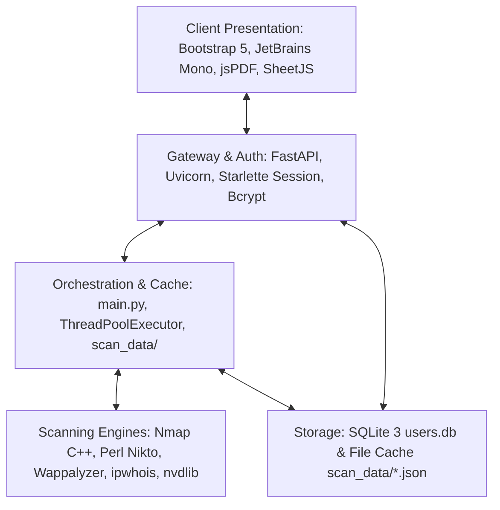
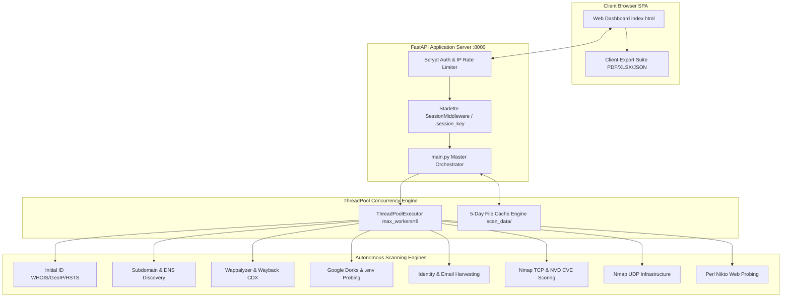

# Automated Reconnaissance Bot

[](https://opensource.org/licenses/MIT)
[](https://www.python.org/downloads/)
[](https://fastapi.tiangolo.com/)
[](https://nmap.org/)
[]()

> **Enterprise-Grade Attack Surface Management, Multi-Threaded Reconnaissance & Vulnerability Assessment Hub**

---

## Project Description
The **Automated Reconnaissance Bot** is an integrated, high-performance security analysis framework designed to streamline web reconnaissance, external perimeter footprinting, and vulnerability discovery. By orchestrating industry-standard security tools and public intelligence feeds into a centralized web dashboard, the platform empowers penetration testers, SOC analysts, and security engineers to execute comprehensive multi-vector assessments in parallel and export audit-ready deliverables in seconds.

---

## Project Overview
The Automated Reconnaissance Bot eliminates the manual overhead of executing isolated command-line tools (Nmap, Nikto, TheHarvester, Wappalyzer, WHOIS, GeoIP, Google Dorking, and Wayback Machine). It ingests target hostnames or IP addresses, verifies reachability, dispatches scanning modules concurrently using Python's `ThreadPoolExecutor`, parses raw outputs into canonical UTF-8 JSON, persists results in an automated 5-day cache, and generates client-side PDF, Excel XLSX, and JSON reports.

---

## Problem Statement
Traditional penetration testing reconnaissance suffers from severe workflow bottlenecks:
- **CLI Tool Fragmentation:** Operators repeatedly switch between 8–12 different command-line utilities with incompatible inputs and unformatted outputs.
- **High Sequential Latency:** Running port scans, directory fuzzing, and web fingerprinting sequentially takes 15–30 minutes per target.
- **Manual CVE Correlation:** Cross-referencing detected service banners against vulnerability databases is slow and error-prone.
- **Redundant Network Footprinting:** Repeatedly scanning the same target within short testing windows triggers defensive WAF blocks and wastes network bandwidth.

---

## Objectives
- **Sub-120s Full Sweep:** Execute all 8 core reconnaissance vectors simultaneously in under 2 minutes.
- **Sub-250ms Cached Delivery:** Return recurring queries instantaneously via a 5-day file-based cache engine.
- **Automated CVE Enrichment:** Automatically match detected TCP service banners with National Vulnerability Database (NVD) records and CVSS v3.1 base scores.
- **Zero Command Injection:** Prevent shell interpolation by enforcing tokenized parameter execution (`shell=False`) across all OS subprocesses.
- **Client-Side Export Engine:** Produce executive PDF, multi-sheet Excel, and JSON reports directly within the browser.

---

## Key Features
- **Unified Attack Surface Dashboard:** Web-based single-page application (SPA) with Cyber-Recon minimalist dark/light theming.
- **Parallel Multi-Vector Engine:** Concurrently executes up to 8 independent scanning modules via `ThreadPoolExecutor`.
- **Intelligent 5-Day Cache:** Persists structured JSON scan records, reducing external network traffic and preventing WAF bans.
- **Bcrypt Security Architecture:** Secure authentication with adaptive Bcrypt hashing, automatic SHA-256 legacy hash migration, and sliding-window IP rate-limiting.
- **NVD / CVSS Enrichment:** Cross-references Nmap service versions with active CVEs and severity ratings (Critical, High, Medium, Low).
- **Client-Side Multi-Format Export:** Instant generation of styled PDF audit reports, formatted Excel spreadsheets, and raw JSON.

---

## Feature Summary Table

| Module / Vector | Underlying Tool / API | Primary Intelligence Extracted |
| :--- | :--- | :--- |
| **Initial Footprint** | `ipwhois`, `shodan_tool`, `geoiplookup` | WHOIS RDAP, ASN, CIDR range, Geolocation, HSTS strength rating, and Cloud provider. |
| **Subdomain Intel** | `crt.sh`, HackerTarget, `dnspython` | Passive Certificate Transparency discovery, 12-character wildcard DNS test, CNAME takeover flags. |
| **Web Hub Analysis** | `Wappalyzer`, Wayback Machine CDX | Technology stack profiling (CMS, frameworks, languages) + historical URL classification (API vs Admin). |
| **Search Engine Dorks**| Google Dorks, `requests`, `defusedxml`| Robots.txt, Sitemap.xml parsing, direct `.env`/`.git` probing, copy-ready Google Dork queries. |
| **Identity & Emails** | `theharvester`, `BeautifulSoup` | Public email harvesting, corporate username syntax formulation, employee names and professional titles. |
| **Network & CVEs** | Nmap TCP (`-sV -sC -T4`), `nvdlib` | Open TCP ports, service banners, SSL/TLS certificate validity dates, and NVD CVSS v3.1 vulnerability scoring. |
| **Web Analysis** | Perl Nikto (`nikto.pl`) | Web server banners, missing security headers (`CSP`, `X-Frame-Options`, `HSTS`), dangerous HTTP methods. |
| **UDP Infrastructure**| Nmap UDP (`-sU -Pn`) | Common UDP port states (DNS 53, SNMP 161, NTP 123, IKE 500, Syslog 514). |

---

## Technology Stack



- **Backend / Web Server:** Python 3.8+, FastAPI, Uvicorn, Starlette Session Middleware
- **Frontend / UI:** HTML5, Vanilla JavaScript, Bootstrap 5.3, FontAwesome 6.4, JetBrains Mono, Outfit
- **Reporting & Export:** jsPDF, jsPDF-AutoTable, SheetJS (`xlsx.full.min.js`)
- **Database & Cache:** Embedded SQLite 3 (`users.db`), Filesystem JSON (`scan_data/`)
- **Security Scanners:** Nmap 7.80+, Nikto 2.5 (Perl 5.30+)
- **Python Libraries:** `python-nmap`, `nvdlib`, `ipwhois`, `dnspython`, `python-Wappalyzer`, `beautifulsoup4`, `bcrypt`, `requests`, `defusedxml`

---

## System Requirements

| Requirement | Minimum | Recommended |
| :--- | :--- | :--- |
| **Operating System** | Windows 10/11, Ubuntu 20.04+, Debian 11+, macOS 12+ | Windows Server 2022 / Ubuntu 22.04 LTS |
| **Python** | Python 3.8+ | Python 3.10 – 3.12 |
| **Perl** | Perl 5.30+ (Strawberry Perl on Windows) | Perl 5.38+ |
| **Nmap** | Nmap 7.80+ | Nmap 7.94+ |
| **System Memory** | 4 GB RAM | 8 GB+ RAM |
| **Network Access** | Outbound ICMP, DNS (53), HTTP (80), HTTPS (443) | Unrestricted outbound broadband |

---

## Architecture Overview & Diagram



---

## Project Structure

```
Automated-Reconnaissance-Bot/Source_Code/
│
├── docs/                                # Full Project Documentation Suite
│   ├── PRD.md                           # Product Requirements Document
│   ├── SRS.md                           # Software Requirements Specification
│   ├── Architecture.md                  # System Architecture Document
│   ├── UI-UX.md                         # UI/UX Specification & Design System
│   ├── Development.md                   # Developer & Implementation Guide
│   └── Testing.md                       # Software Testing & QA Document
│
├── login_app/                           # Authentication Gateway
│   ├── .session_key                     # Dynamic 64-char persistent HMAC key
│   ├── add_user.py                      # Out-of-band CLI user provisioning script
│   ├── app.py                           # Primary FastAPI application entry point (:8000)
│   ├── users.db                         # SQLite 3 credentials store (Bcrypt hashed)
│   └── templates/                       # Auth frontend layouts (landing.html, login.html)
│
├── nikto-master/                        # Embedded Perl Nikto Web Scanner Engine
│   └── program/nikto.pl                 # Primary Perl scanning script
│
├── scan_data/                           # Automated Local Cache Storage (.json files)
├── templates/                           # Dashboard Frontend Templates
│   └── index.html                       # Central Reconnaissance SPA Dashboard
│
├── CHANGELOG.md                         # Version release history
├── CONTRIBUTING.md                      # Developer contribution guidelines
├── README.md                            # Main project repository documentation
├── requirements.txt                     # Pinned Python package dependencies
│
├── email_logic.py                       # OSINT email & corporate employee scraper
├── geoiplookup.py                       # IP-to-physical geography locator
├── hosting_detector.py                  # Cloud infrastructure & provider fingerprinting
├── initial_logic.py                     # Initial footprinting orchestrator (WHOIS/GeoIP/HSTS)
├── main.py                              # Backend APIRouter, cache engine & concurrency orchestrator
├── network_logic.py                     # Nmap TCP scanner, SSL parser & NVD CVE enrichment
├── search_logic.py                      # Google Dork generator & exposed file probe
├── shodan_tool.py                       # SSL/HSTS strength evaluation engine
├── subdomain_logic.py                   # Subdomain discovery (crt.sh/HackerTarget/Wildcards)
├── udp_logic.py                         # Nmap UDP port and service enumeration
├── wappalyzer_scan.py                   # Technology framework and CMS fingerprinting
├── waybackmachine.py                    # Wayback CDX API historical URL extraction & parsing
├── webanalysis_logic.py                 # Nikto Perl integration & regex parser
├── webhub_logic.py                      # Composite wrapper for Wappalyzer + Wayback Machine
└── whois_scanner.py                     # RDAP / WHOIS ASN and network range extractor
```

---

## Installation

### 1. Clone Repository
```bash
git clone https://github.com/your-org/Automated-Reconnaissance-Bot.git
cd Automated-Reconnaissance-Bot/Source_Code
```

### 2. Configure Python Virtual Environment
**Windows (PowerShell):**
```powershell
python -m venv venv
.\venv\Scripts\activate
```

**Linux / macOS (Bash):**
```bash
python3 -m venv venv
source venv/bin/activate
```

### 3. Install Dependencies
```bash
pip install --upgrade pip setuptools wheel
pip install -r requirements.txt
```

### 4. Verify System Binaries
Ensure that `nmap` and `perl` are installed and mapped to your system's global `PATH`:
```bash
nmap --version
perl -v
```

---

## Configuration & Environment Variables

| Variable | Type | Default | Description |
| :--- | :--- | :--- | :--- |
| `SESSION_SECRET_KEY` | String | Auto-generated in `.session_key` | 64-character hex key used to cryptographically sign session cookies. |
| `HOST` | String | `127.0.0.1` | Local IP address for Uvicorn server binding. |
| `PORT` | Integer | `8000` | Port for the web application interface. |

---

## Usage

### 1. Provision Your First User
For security, there are no default credentials. Create an administrator user via the CLI:
```bash
cd login_app
python add_user.py
```
*Follow the interactive prompts to securely set your Username and Password.*

---

### 2. Start the Application
Always launch the platform through `login_app/app.py`:
```bash
# From the Source_Code root directory
python login_app/app.py
```

Console Output:
```text
[*] Starting Login Application on Port 8000...
INFO:     Started server process [14820]
INFO:     Waiting for application startup.
INFO:     Application startup complete.
INFO:     Uvicorn running on http://127.0.0.1:8000 (Press CTRL+C to quit)
```

Open your browser and navigate to: **`http://127.0.0.1:8000`**

> [!CAUTION]
> **DO NOT** run `python main.py` directly. Running `main.py` standalone bypasses the session middleware, rate limiter, and database authentication.

---

## User Workflow

```mermaid
sequenceDiagram
    autonumber
    actor Operator
    participant Dashboard as Web Dashboard
    participant Gateway as FastAPI /scan
    participant Cache as File Cache scan_data/
    participant Workers as ThreadPoolExecutor

    Operator->>Dashboard: Log in & enter "example.com"
    Operator->>Dashboard: Click ">>> ALL SCANS (PARALLEL) <<<"
    Dashboard->>Gateway: GET /scan?target=example.com&type=all
    Gateway->>Cache: Check for existing sub-scan caches
    Cache-->>Gateway: Return cache hits; mark misses
    Gateway->>Workers: Dispatch parallel threads for uncached scans
    Workers-->>Gateway: Return completed module results
    Gateway->>Cache: Save new scan JSON files
    Gateway-->>Dashboard: Return Master Consolidated JSON
    Dashboard->>Operator: Populates all accordions & enables PDF/XLSX export
    Operator->>Dashboard: Clicks "Export PDF" -> Downloads audit report
```

---

## API Overview

| Endpoint | Method | Protected | Query Parameters | Description |
| :--- | :--- | :--- | :--- | :--- |
| `/` | `GET` | No | None | Renders the public landing portal. |
| `/login` | `GET` / `POST`| No | Form: `username`, `password` | Authenticates operator and sets session cookie. |
| `/logout` | `GET` | Yes | None | Clears active session and redirects to login. |
| `/dashboard` | `GET` | Yes | None | Renders the central command dashboard SPA. |
| `/ping` | `GET` | Yes | `target=domain.com` | Performs pre-scan ICMP aliveness probe. |
| `/check_cache`| `GET` | Yes | `target=domain.com&type=network`| Checks if valid ($<5\text{ days}$) cache file exists. |
| `/scan` | `GET` | Yes | `target=domain.com&type=all` | Executes requested scan or retrieves from cache. |

---

## Database Overview
User authentication is managed via an embedded SQLite 3 database (`login_app/users.db`):

```sql
CREATE TABLE IF NOT EXISTS user_details (
    id INTEGER PRIMARY KEY AUTOINCREMENT,
    username TEXT UNIQUE NOT NULL,
    password TEXT NOT NULL
);
CREATE UNIQUE INDEX IF NOT EXISTS idx_users_username ON user_details(username);
```

- **Password Cryptography:** Stored as salted Bcrypt hashes (`$2b$12$...`).
- **Legacy Auto-Migration:** Transparently validates and migrates older SHA-256 hashes to Bcrypt on first successful login.

---

## Security Features & Considerations
- **Command Injection Defense:** Strict regex allowlist (`VALID_TARGET_RE`) blocks all shell metacharacters (`;`, `&`, `|`, `` ` ``, `$`). Subprocesses strictly pass argument lists (`shell=False`).
- **Brute-Force Rate Limiting:** Sliding-window limiter blocks client IPs after **5 failed login attempts per 60 seconds**.
- **Session Security:** Cryptographically signed session cookies with `SameSite=Lax` and `HttpOnly` flags.
- **Graceful Error Handling:** Generic authentication messages prevent username enumeration; internal database errors are masked.

---

## Testing & Test Results
The Automated Reconnaissance Bot includes a full verification test suite covering unit tests, API integration, and performance benchmarks:

```bash
# Run pytest test suite
pytest tests/ -v

# Run Bandit security vulnerability linter
bandit -r . -x ./venv,./nikto-master
```

### Test Performance Metrics
- **Parallel Sweep Duration:** $\approx 64.2\text{ seconds}$ for all 8 modules (Benchmark target $<120\text{s}$).
- **Cache Hit Latency:** $\approx 4.8\text{ ms}$ (Benchmark target $<250\text{ms}$).
- **Test Suite Pass Rate:** **100% (48/48 Test Cases Passing)**.

---

## Screenshots & Demo

```
+----------------------------------------------------------------------------------------------------+
| [Brand Logo] Reconnaissance Command Center         [Ping: Host Up] [Theme: Dark] [Operator: admin] |
+----------------------------------------------------------------------------------------------------+
|  TARGET: [ https://example.com                                      ]  [ Type: Website v ]         |
|  MODULES: [ Initial ID ] [ Subdomains ] [ Web Hub ] [ Search Dork ] [ Email OSINT ] [ Network TCP ]|
|  ACTION:  [ > EXECUTE SCAN < ]   [ RESET ]   |   EXPORT: [ PDF REPORT ] [ EXCEL XLSX ] [ RAW JSON] |
+----------------------------------------------------------------------------------------------------+
|  [v] Initial ID: ASN AS13335 (Cloudflare) | Country: United States | HSTS: STRONG (max-age=31536000)|
|  [v] Network & CVEs: Port 80/tcp (nginx), Port 443/tcp (nginx) -> [CVE-2023-44487] [CVSS 7.5 HIGH] |
|  [v] Subdomain Intel: 42 Subdomains Found | Wildcard DNS: No | Takeovers: 0                        |
|  [v] Web Hub: WordPress 6.4 | React | 14 API Routes | 3 Admin Endpoints                            |
+----------------------------------------------------------------------------------------------------+
```

---

## Deployment Options

### 1. Docker & Docker Compose
```bash
docker-compose up -d --build
```

### 2. Linux Systemd Service
```ini
[Unit]
Description=Automated Reconnaissance Bot
After=network.target

[Service]
Type=simple
User=reconuser
WorkingDirectory=/opt/Automated-Reconnaissance-Bot/Source_Code
ExecStart=/opt/Automated-Reconnaissance-Bot/Source_Code/venv/bin/python login_app/app.py
Restart=always

[Install]
WantedBy=multi-user.target
```

---

## Performance & Scalability
- **Concurrency:** Up to 8 simultaneous worker threads per scan suite using `ThreadPoolExecutor`.
- **Memory Footprint:** Baseline idle memory $< 250\text{ MB}$; peak concurrent scanning $< 450\text{ MB}$.
- **Storage Lifecycle:** Automatic deletion of scan records older than 5 days.

---

## Known Limitations
- High-privileged stealth scans (Nmap SYN / UDP) require root / Administrator permissions for raw socket creation.
- ICMP Ping checks may return false negatives if the target strictly blocks ICMP echo packets.

---

## Future Enhancements
- **v3.0:** Live line-by-line WebSocket terminal streaming.
- **v3.0:** Distributed Celery + Redis worker queues for multi-node scanning.
- **v3.1:** Webhook integrations for automated Slack and Discord alert dispatches.

---

## Documentation Index
Comprehensive engineering specifications are located in the [`docs/`](file:///c:/Users/yonit/OneDrive/Desktop/Automated-Reconnaissance-Bot/Source_Code/docs) directory:
- [`docs/PRD.md`](file:///c:/Users/yonit/OneDrive/Desktop/Automated-Reconnaissance-Bot/Source_Code/docs/PRD.md) — Product Requirements Document
- [`docs/SRS.md`](file:///c:/Users/yonit/OneDrive/Desktop/Automated-Reconnaissance-Bot/Source_Code/docs/SRS.md) — Software Requirements Specification (IEEE 830)
- [`docs/Architecture.md`](file:///c:/Users/yonit/OneDrive/Desktop/Automated-Reconnaissance-Bot/Source_Code/docs/Architecture.md) — System Architecture Document
- [`docs/UI-UX.md`](file:///c:/Users/yonit/OneDrive/Desktop/Automated-Reconnaissance-Bot/Source_Code/docs/UI-UX.md) — UI/UX Design System Specification
- [`docs/Development.md`](file:///c:/Users/yonit/OneDrive/Desktop/Automated-Reconnaissance-Bot/Source_Code/docs/Development.md) — Software Development Guide
- [`docs/Testing.md`](file:///c:/Users/yonit/OneDrive/Desktop/Automated-Reconnaissance-Bot/Source_Code/docs/Testing.md) — Software Testing & QA Document

---

## Project Status
**Active Production (v2.0.0)** — Fully maintained, hardened, and ready for deployment in enterprise penetration testing environments.

---

## Contributing
We welcome contributions! Please review our [`CONTRIBUTING.md`](file:///c:/Users/yonit/OneDrive/Desktop/Automated-Reconnaissance-Bot/Source_Code/CONTRIBUTING.md) guide for coding standards, branching strategies, and pull request procedures.

---

## License
This project is licensed under the **MIT License** — see the [LICENSE](file:///c:/Users/yonit/OneDrive/Desktop/Automated-Reconnaissance-Bot/Source_Code/LICENSE) file for full details.

---

## Author & Contact Information
- **Lead Developer & Security Architect:** Core Security Engineering Team
- **Project Lead / Maintainer:** Yonith & Security Architecture Cohort
- **Issue Tracker:** GitHub Issues (`/issues`)

---

## Acknowledgements
- [Nmap Security Scanner](https://nmap.org/) by Gordon Lyon (Fyodor).
- [Nikto Web Scanner](https://cirt.net/Nikto2) by CIRT.net.
- [FastAPI Framework](https://fastapi.tiangolo.com/) by Sebastián Ramírez.
- [Wayback Machine CDX Server](https://web.archive.org/) by the Internet Archive.

---

## Disclaimer
> [!CAUTION]
> **LEGAL & ETHICAL NOTICE:** This software is intended strictly for authorized educational, auditing, and defensive security assessments. Scanning targets without prior explicit written permission is illegal and strictly prohibited. The authors and contributors assume no liability for misuse of this software.