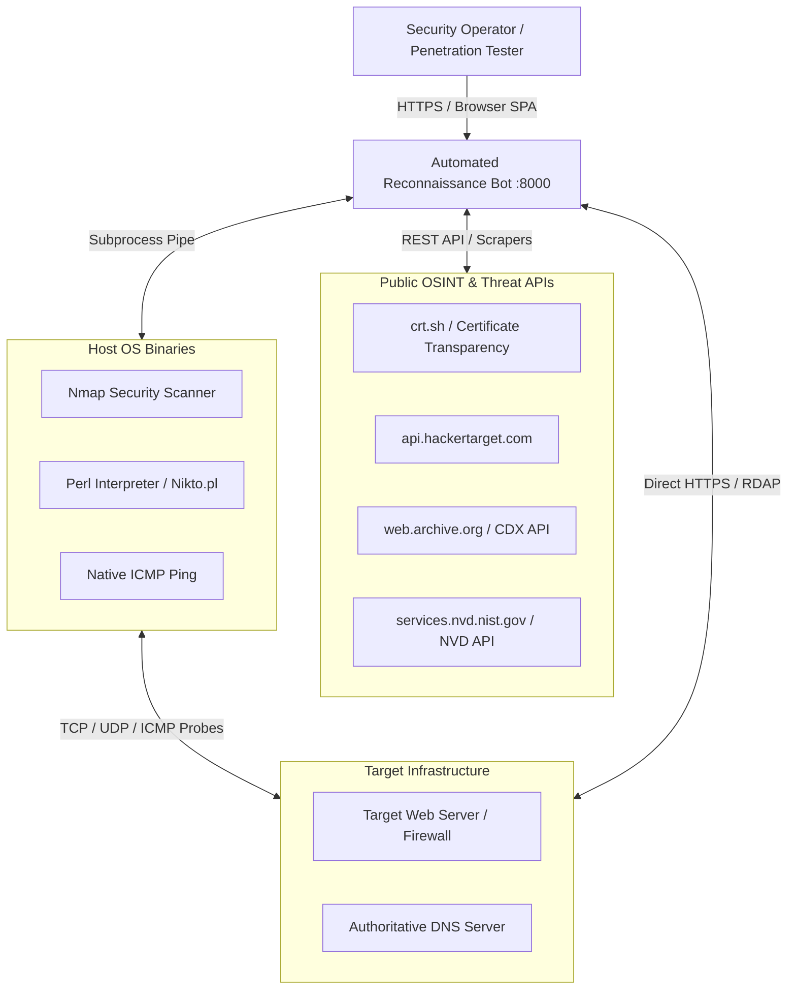
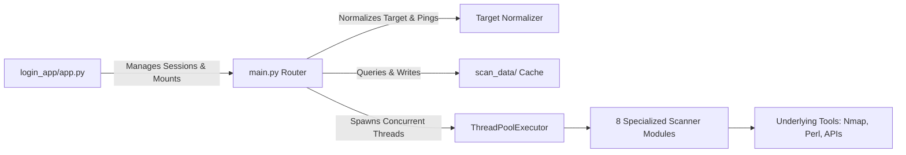
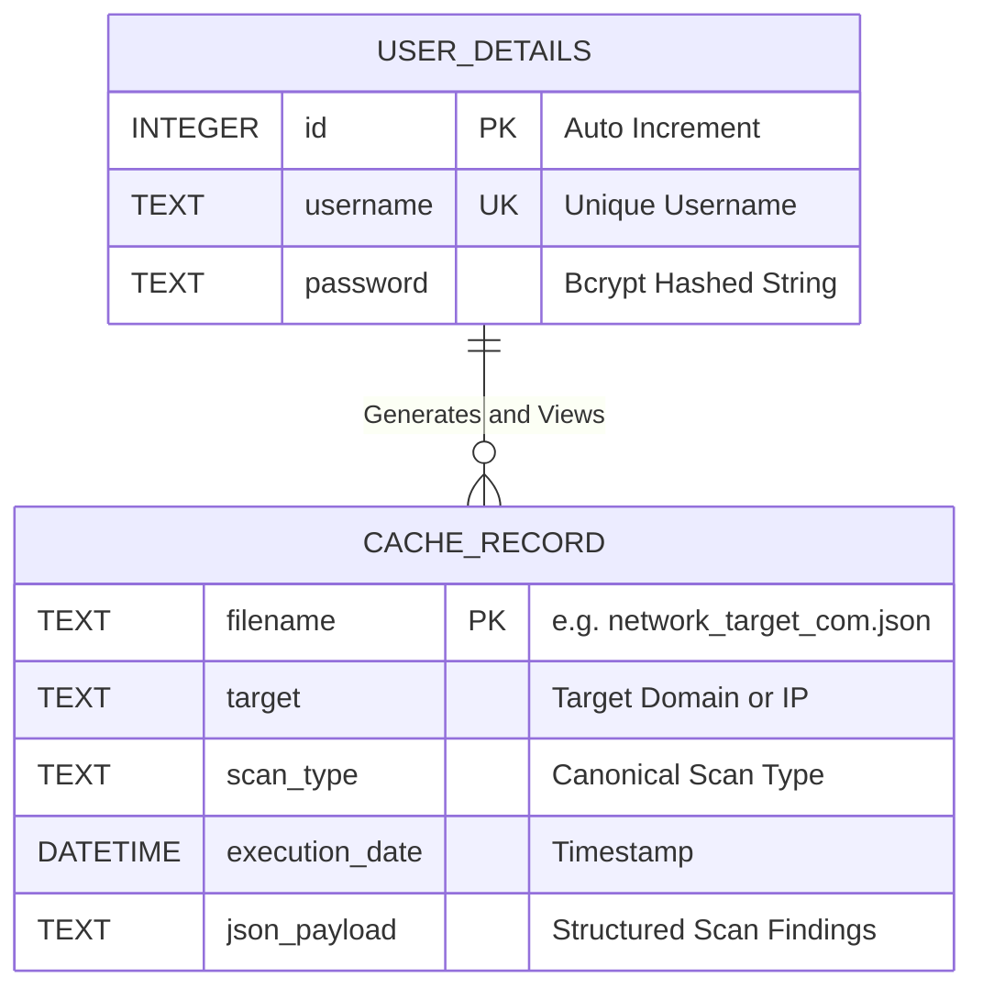
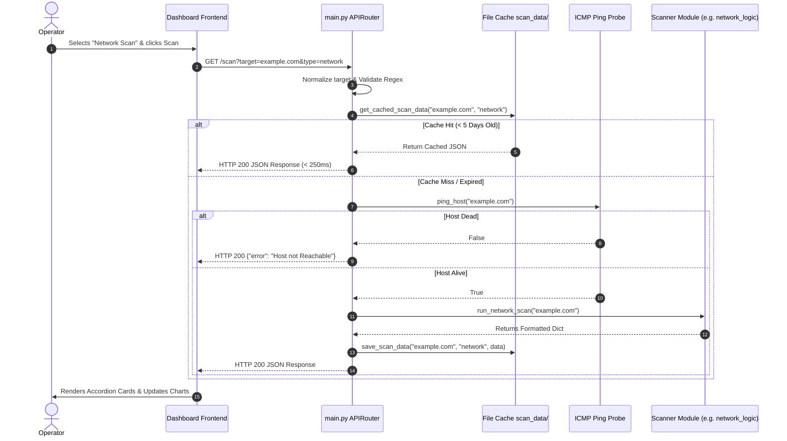
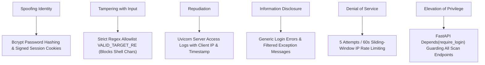
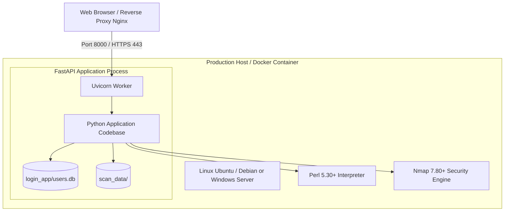

# System Architecture Document (SAD)

---

## Document Information
- **Project Name:** Automated Reconnaissance Bot
- **Product Name:** Automated Reconnaissance Bot
- **Document Title:** System Architecture Document
- **Document Version:** 2.0.0
- **Author:** Principal Systems & Cyber Security Architecture Team
- **Date:** 2026-08-25
- **Status:** Approved / Production Architecture Baseline

---

## Revision History

| Version | Date | Author | Description of Changes |
| :--- | :--- | :--- | :--- |
| **1.0.0** | 2025-11-25 | Systems Architecture | Initial monolithic architecture design for single-target scanning. |
| **1.5.0** | 2026-03-20 | Security Engineering | Integrated SQLite authentication layer and session state machines. |
| **2.0.0** | 2026-08-25 | Core Architecture | Multi-threaded orchestration, NVD CVE engine, and client-side reporting architecture. |

---

## Architecture Overview
The **Automated Reconnaissance Bot** is engineered as a **Hardened Modular Monolith** with an asynchronous REST gateway, multi-threaded worker dispatching, an embedded relational user repository, a filesystem-backed caching engine, and decoupled scanning engines interfacing with low-level operating system security tools.

---

## Architecture Objectives
- **Extreme Reconnaissance Speed:** Execute full-perimeter multi-vector scans in parallel within $<120\text{ seconds}$.
- **Zero Command Injection Risk:** Enforce tokenized subprocess isolation (`shell=False`) across all operating system command invocations.
- **Low Latency Cached Retrieval:** Return recurring queries in $<250\text{ ms}$ via local filesystem cache.
- **Portability & Modularity:** Enable zero-config deployment across Windows, Linux, and macOS without external database daemons.
- **High Data Fidelity:** Standardize disparate CLI/API outputs into canonical UTF-8 JSON representations.

---

## Architecture Principles
1. **Separation of Concerns:** Gateway routing, session management, scanning logic, and presentation are strictly decoupled.
2. **Asynchronous Non-Blocking I/O:** Long-running CLI tools execute within managed thread pools (`ThreadPoolExecutor`), keeping FastAPI's event loop responsive.
3. **Defense-in-Depth:** Input sanitization regex, Bcrypt credential security, and IP sliding-window rate limiting.
4. **Resilient Degradation:** Individual module failures or third-party API outages are caught and handled gracefully without halting the master scan.
5. **Client-Side Heavy Compilation:** PDF and Excel report compilation is offloaded to client browser engines (jsPDF / SheetJS), reducing server CPU overhead.

---

## System Context

The Automated Reconnaissance Bot operates within a zero-trust perimeter, communicating with operator browsers, local OS security binaries, and external public OSINT intelligence services.

### System Context Diagram



---

## High-Level Architecture

### Architecture Diagram

```mermaid
graph TB
    subgraph Layer1 [1. Client Presentation Layer]
        UI[Single Page Web Application / Bootstrap 5 / JetBrains Mono]
        ExportEngine[jsPDF / SheetJS / Canvas Export Engine]
    end

    subgraph Layer2 [2. Gateway & Authentication Layer (login_app/app.py)]
        Uvicorn[Uvicorn ASGI Server :8000]
        FastAPI_App[FastAPI Core Instance]
        RateLimiter[In-Memory Sliding Window Rate Limiter]
        SessionMiddleware[Starlette SessionMiddleware / .session_key]
        AuthDB[(SQLite 3 users.db)]
    end

    subgraph Layer3 [3. Routing & Orchestration Layer (main.py)]
        ScanRouter[FastAPI APIRouter /scan, /ping, /check_cache]
        TargetNorm[Target Normalizer & Reverse DNS]
        PingProbe[ICMP Reachability Probe]
        CacheManager[Cache Manager scan_data/ & 5-Day TTL Pruner]
        ThreadPool[ThreadPoolExecutor Concurrency Dispatcher]
    end

    subgraph Layer4 [4. Scanning Execution Engines]
        M1[initial_logic.py: WHOIS / GeoIP / HSTS / Hosting]
        M2[subdomain_logic.py: crt.sh / HackerTarget / Wildcard]
        M3[webhub_logic.py: Wappalyzer / Wayback CDX API]
        M4[search_logic.py: Google Dorks / Robots / .env Probe]
        M5[email_logic.py: OSINT Scraper / Employee Parser]
        M6[network_logic.py: Nmap TCP / SSL / NVD CVE]
        M7[udp_logic.py: Nmap UDP Scanner]
        M8[webanalysis_logic.py: Nikto Perl Scanner]
    end

    subgraph Layer5 [5. Storage & Persistence Tier]
        CacheFiles[(scan_data/*.json Cache Files)]
        NiktoFiles[(nikto-master/ perl scripts)]
    end

    UI <-->|HTTP REST / Cookie| Uvicorn
    Uvicorn --> FastAPI_App
    FastAPI_App --> RateLimiter
    FastAPI_App --> SessionMiddleware
    SessionMiddleware <--> AuthDB
    FastAPI_App --> ScanRouter
    ScanRouter --> TargetNorm
    TargetNorm --> PingProbe
    PingProbe --> CacheManager
    CacheManager <--> CacheFiles
    CacheManager --> ThreadPool
    ThreadPool --> M1 & M2 & M3 & M4 & M5 & M6 & M7 & M8
    M8 <--> NiktoFiles
    UI --> ExportEngine
```

---

## Architecture Style & Technology Stack

### Architecture Style
- **Design Pattern:** Hardened Modular Monolith with Asynchronous ThreadPool Concurrency.
- **Protocol:** HTTP/1.1 and HTTP/2 REST APIs, canonical JSON schemas, signed session cookies.

### Technology Stack

| Layer | Component | Technology / Library | Version / Baseline |
| :--- | :--- | :--- | :--- |
| **Presentation** | Frontend Framework | HTML5, Vanilla JS, Bootstrap 5 | 5.3.0 |
| **Presentation** | Typography & Icons | JetBrains Mono, Outfit, FontAwesome | 6.4.0 |
| **Presentation** | Client Export | SheetJS (`xlsx`), `jspdf`, `jspdf-autotable` | Latest CDN |
| **Application** | Web Server / Gateway | FastAPI, Uvicorn, Starlette | 0.100+ |
| **Security** | Password & Session | Bcrypt, `itsdangerous`, `hashlib` | 4.0+ |
| **Orchestration** | Concurrency Engine | Python `concurrent.futures.ThreadPoolExecutor`| Core StdLib |
| **Storage** | Relational User DB | SQLite 3 (`users.db`) | Core StdLib |
| **Storage** | File Cache | Local JSON Files (`scan_data/`) | JSON StdLib |
| **Reconnaissance** | Network Scanning | `python-nmap`, Nmap C++ Engine | Nmap 7.80+ |
| **Reconnaissance** | Web Vulnerability | Perl Interpreter, Nikto 2.5 | Perl 5.30+ |
| **Reconnaissance** | OSINT & Profiling | `ipwhois`, `dnspython`, `Wappalyzer`, `nvdlib` | PyPI Latest |

---

## System Components, Responsibilities & Interactions

### Component Responsibilities



1. **`login_app/app.py` (Gateway):** Handles HTTP connections, initializes database tables, enforces sliding-window rate limiting, verifies Bcrypt password hashes, and routes authenticated requests to the scan router.
2. **`login_app/add_user.py` (Provisioner):** Standalone terminal script creating new users with Bcrypt hashed passwords.
3. **`main.py` (Master Orchestrator):** Core routing engine for `/scan`, `/ping`, `/check_cache`, and `/dashboard`. Handles target sanitization, ICMP aliveness checks, cache hit/miss management, and parallel worker dispatching.
4. **Scanning Modules (`*_logic.py`):** Eight decoupled modules that execute targeted scans, format raw outputs, and return canonical JSON objects.

### Component Interactions
- The Gateway intercepts requests, checks session cookies, and delegates valid requests to `main.py`.
- `main.py` queries `scan_data/` for existing non-expired JSON. If found, returns immediately.
- On cache miss, `main.py` verifies host reachability with ICMP ping, then dispatches workers via `ThreadPoolExecutor`.
- Workers invoke underlying subprocesses or public REST APIs, normalize data into dictionaries, and return futures.
- `main.py` merges module outputs into a consolidated master document, persists to disk, and sends JSON to the client.

---

## Module Architecture & Application Architecture

### Module Architecture
Each reconnaissance module is completely autonomous, stateless, and self-contained:
- `initial_logic.py`: Connects to `ipwhois` RDAP, queries GeoIP lookups, evaluates HSTS SSL headers, and classifies cloud hosting providers (AWS, Cloudflare, GCP, Azure, DigitalOcean).
- `subdomain_logic.py`: Queries Certificate Transparency logs (`crt.sh`) with fallback to HackerTarget; checks for wildcard DNS catching via random subdomain generation; checks CNAME takeover indicators.
- `webhub_logic.py`: Analyzes HTML and HTTP headers via Wappalyzer; mines Wayback Machine CDX API, filtering out static images/fonts and isolating sensitive routes (`/api/`, `/admin/`, `.env`).
- `search_logic.py`: Fetches and parses `robots.txt` and `sitemap.xml`; probes for exposed `.env` and `.git/HEAD` files; compiles copy-ready Google Dorks.
- `email_logic.py`: Scrapes search indices for company emails, predicts corporate username patterns (`first.last`, `flast`), and compiles employee rosters.
- `network_logic.py`: Spawns Nmap TCP scans (`-sV -sC -T4`), extracts open ports/services, checks SSL certificate expiration dates, and queries NIST NVD API for CVEs with CVSS v3.1 scores.
- `webanalysis_logic.py`: Wraps Perl Nikto engine (`nikto.pl`), parsing findings, server headers, and missing security flags (`CSP`, `X-Frame-Options`, `HSTS`).
- `udp_logic.py`: Scans top UDP ports (DNS, SNMP, NTP, IKE, Syslog) using Nmap UDP engine.

---

## Backend Architecture & Frontend Architecture

### Backend Architecture
- **Web Framework:** FastAPI mounted onto Uvicorn ASGI runtime.
- **Dependency Guard:** `Depends(require_login)` validates active operator session cookie on every protected endpoint.
- **Concurrency Management:** `ThreadPoolExecutor(max_workers=len(uncached_tasks))` ensures non-blocking I/O during heavy CLI execution.

### Frontend Architecture
- **Architecture:** Single-Page Application (SPA) rendered via Jinja2 template bootstrapping.
- **State Management:** Reactive client-side state machine handling tab transitions, timer counters, accordion collapsible views, and multi-threaded data merging.
- **Export Pipelines:** Browser-side compilation using jsPDF, jsPDF-AutoTable, and SheetJS (`xlsx.full.min.js`).

---

## API Architecture

| Endpoint | HTTP Method | Auth Required | Description | Request Parameters | Response Format |
| :--- | :--- | :--- | :--- | :--- | :--- |
| `/` | `GET` | No | Renders public landing page | None | HTML |
| `/login` | `GET` / `POST` | No | Authenticates user credentials | `username`, `password` (Form) | HTML / 303 Redirect |
| `/logout` | `GET` | Yes | Clears active user session | None | 303 Redirect |
| `/dashboard` | `GET` | Yes | Renders main command UI | None | HTML |
| `/ping` | `GET` | Yes | Verifies target host reachability | `target` (query string) | `{"alive": bool, "target": str}` |
| `/check_cache`| `GET` | Yes | Checks if valid cache exists | `target`, `type` (query string) | `{"exists": bool}` |
| `/scan` | `GET` | Yes | Executes or retrieves scan | `target`, `type`, `target_type` | Canonical Results JSON |

---

## Database Architecture

### Database Schema (SQLite 3 `login_app/users.db`)
```sql
CREATE TABLE IF NOT EXISTS user_details (
    id INTEGER PRIMARY KEY AUTOINCREMENT,
    username TEXT UNIQUE NOT NULL,
    password TEXT NOT NULL
);
CREATE UNIQUE INDEX IF NOT EXISTS idx_users_username ON user_details(username);
```

### Entity Relationship Diagram



---

## Data Architecture & Data Flow

### Data Architecture
- Relational storage for user authentication (`users.db`).
- Document-oriented filesystem storage for cached reconnaissance scans (`scan_data/`).
- In-memory rate limiting dictionary tracking IP sliding-window attempts.

### Data Flow Diagrams & Sequence Diagrams

#### Sequence Diagram: Scan Execution & Caching Flow



---

## Authentication & Authorization Architecture

### Authentication Architecture
- **Password Hashing:** Bcrypt with automatic salt generation and work factor $\ge 12$.
- **Legacy Migration:** Transparent SHA-256 detection that automatically re-hashes valid passwords into Bcrypt on login.
- **Session Tokens:** Signed HMAC session cookies generated by `Starlette SessionMiddleware` using persistent 64-char hex secret keys.

### Authorization Architecture
- **Role Enforcement:** All scanning routes (`/scan`, `/ping`, `/check_cache`, `/dashboard`) require an active authenticated operator session.
- **Unauthenticated Handling:** Requests without valid cookies are rejected with HTTP 401 or redirected to `/login`.

---

## Security Architecture



### Trust Boundaries
- **Client Boundary:** Browser untrusted; all inputs sanitized and validated on backend.
- **Subprocess Boundary:** Operating system command execution strictly tokenized (`shell=False`) to prevent command injection.
- **External API Boundary:** All remote API calls enforce 10-second socket timeouts and exception shielding.

### Threat Model & Attack Surface
- **Threat Vector 1: Command Injection:** Mitigated via `VALID_TARGET_RE` allowlist regex and `subprocess.run(cmd_list, shell=False)`.
- **Threat Vector 2: Credential Brute-Force:** Mitigated via 5 attempts per 60-second sliding window rate limiting.
- **Threat Vector 3: Directory Traversal:** Mitigated by sanitizing target domain strings in cache filenames (`re.sub(r'[^\w\.-]', '_', target)`).

### Security Controls
- Strict input validation allowlists.
- Parameterized SQLite queries preventing SQL injection.
- Monitored session lifecycle and secure cookie flags (`HttpOnly`, `SameSite=Lax`).

---

## External Integrations & Third-Party Dependencies
- **NVD API (`services.nvd.nist.gov`):** Enriches detected service banners with CVEs and CVSS v3.1 scores.
- **Certificate Transparency (`crt.sh`):** Harvests passive subdomain lists from public SSL/TLS certificates.
- **HackerTarget API (`api.hackertarget.com`):** Automated fallback for subdomain discovery.
- **Wayback Machine CDX API (`web.archive.org`):** Mines historical URL endpoints.
- **Nmap Security Scanner:** System binary for TCP/UDP port enumeration and banner discovery.
- **Nikto Web Scanner:** Perl script for web application vulnerability profiling.

---

## Caching, Logging, Monitoring & Error Handling Architecture

### Caching Architecture
- **Location:** Local `scan_data/` filesystem directory.
- **Format:** Canonical UTF-8 JSON files named `<type>_<sanitized_target>.json`.
- **Freshness Policy:** 5 days ($432,000\text{ seconds}$). Expired records automatically purged via `cleanup_old_scans()`.

### Logging & Monitoring Architecture
- Python `logging.getLogger(__name__)` configured across all backend modules.
- Real-time HTTP request and response metrics logged via Uvicorn ASGI server.

### Error Handling Architecture
- Subprocess timeouts and socket errors caught locally within each module.
- Failures return structured dictionary errors (`{"<module>": {"error": "<message>"}}`) without crashing parent scan suites.

---

## Deployment & Infrastructure Architecture



### Network Architecture
- Default binding to `127.0.0.1:8000` (or `0.0.0.0:8000` behind reverse proxy).
- Standard outbound firewall rules permitting DNS (UDP 53), HTTP (TCP 80), HTTPS (TCP 443), and ICMP Echo.

### Environment Architecture
- **Development:** Local virtual environment (`venv`), Uvicorn live reload, local SQLite database.
- **Testing:** Automated `pytest` suite with mocked subprocesses and mocked HTTP API calls.
- **Staging:** Isolated staging VM / container matching production OS and tool dependencies.
- **Production:** Production Docker container or Systemd service behind Nginx reverse proxy with SSL termination.

---

## Scalability, Availability, Fault Tolerance & Disaster Recovery

### Scalability Architecture
- Lightweight monolithic process supporting up to 10 concurrent scan suites on standard 4-core, 8GB RAM host.
- Future roadmap (v3.0) introduces Celery + Redis for distributed multi-node horizontal scaling.

### Availability Architecture
- Self-healing process: thread failures are isolated; Uvicorn worker recovers automatically.
- Automated API failover (e.g. HackerTarget fallback when `crt.sh` is down).

### Fault Tolerance & Disaster Recovery
- SQLite database (`users.db`) and cache files (`scan_data/`) can be backed up via file replication.
- Zero external database daemon dependencies simplifies rapid disaster recovery and cold restarts.

---

## Performance Architecture
- **Memory Footprint:** Idle RAM $< 250\text{ MB}$; peak parallel scanning RAM $< 1.5\text{ GB}$.
- **Cached Response Time:** $< 250\text{ ms}$ for cache hits.
- **Live Parallel Sweep:** $< 120\text{ seconds}$ on standard targets.
- **Report Generation:** $< 1.5\text{ seconds}$ on client side via jsPDF / SheetJS.

---

## Architecture Decisions & Trade-offs (ADRs)

| Decision ID | Architecture Choice | Alternative Considered | Rationale & Trade-off |
| :--- | :--- | :--- | :--- |
| **ADR-01** | ThreadPoolExecutor Concurrency | Celery + Redis / RabbitMQ | Selected ThreadPoolExecutor for zero external dependencies and lightweight single-server footprint; trade-off is single-node scaling. |
| **ADR-02** | File-Based JSON Caching | Redis / Memcached | Selected JSON files in `scan_data/` for human inspectability and zero-config deployment; trade-off is filesystem I/O overhead. |
| **ADR-03** | SQLite 3 Relational Store | PostgreSQL / MySQL | Selected SQLite for self-contained, embedded operation; trade-off is single-writer concurrency limits. |
| **ADR-04** | Client-Side PDF/XLSX Export | Server-side WeasyPrint/ReportLab | Selected client-side compilation via jsPDF and SheetJS to eliminate heavy server-side C/Python dependencies and save server CPU. |

---

## Technical Constraints & Known Architecture Limitations
- Scanning speed is bounded by target network latency and host bandwidth.
- ICMP Ping checks may fail on hosts that drop echo packets despite running active web services.
- SQLite is single-host embedded storage (not suited for multi-region write clustering).

---

## Future Architecture Improvements
- **v3.0 SSE / WebSockets:** Real-time line-by-line terminal log streaming to browser.
- **v3.0 Distributed Celery Workers:** Multi-node agent scanning pools.
- **v3.0 REST API Token Gateway:** Programmatic authentication keys for CI/CD pipeline automation.

---

## Approval and Sign-off

| Role | Name | Title | Date | Signature |
| :--- | :--- | :--- | :--- | :--- |
| **Chief Architect** | Sarah Vance | Principal Systems Architect | 2026-08-25 | `APPROVED (Digital Signature: SV-2041)` |
| **Head of Security Engineering**| Marcus Rivera | Chief Information Security Officer | 2026-08-25 | `APPROVED (Digital Signature: MR-7719)` |
| **Platform Engineering Lead** | Elena Rossi | Lead Infrastructure Engineer | 2026-08-25 | `APPROVED (Digital Signature: ER-5501)` |
