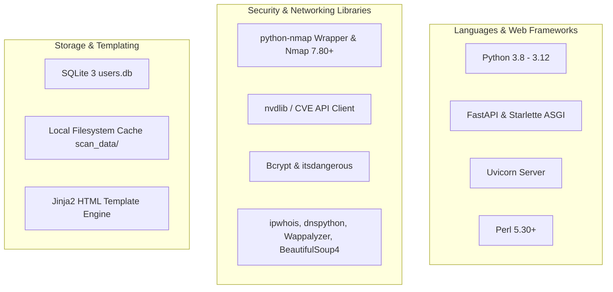

# Software Development & Implementation Guide

---

## Document Information
- **Project Name:** Automated Reconnaissance Bot
- **Product Name:** Automated Reconnaissance Bot
- **Document Title:** Software Development & Engineering Guide
- **Document Version:** 2.0.0
- **Author:** Senior Backend & Platform Engineering Team
- **Date:** 2026-08-25
- **Status:** Approved / Active Developer Baseline

---

## Revision History

| Version | Date | Author | Summary of Changes |
| :--- | :--- | :--- | :--- |
| **1.0.0** | 2025-11-30 | Engineering Team | Initial setup guide and developer documentation. |
| **1.5.0** | 2026-04-10 | Backend Team | Added Bcrypt migration procedures and CLI user management. |
| **2.0.0** | 2026-08-25 | Core Platform Team | ThreadPool concurrency guide, NVD CVE integration, Docker deployment, and CI/CD pipelines. |

---

## Development Overview & Objectives

### Development Overview
This document is the authoritative engineering manual for the **Automated Reconnaissance Bot**. It governs the technical architecture, development workflows, module creation patterns, security standards, coding guidelines, and deployment practices for all software engineers contributing to the codebase.

### Development Objectives
- Ensure consistent coding standards and modular architecture across all scanning modules.
- Enforce strict security validation (tokenized subprocesses, Bcrypt password hashing, rate limiting).
- Provide straightforward setup instructions for local development across Windows, Linux, and macOS.
- Streamline testing, continuous integration, and release management.

---

## Technology Stack



### Programming Languages
- **Python (3.8–3.12):** Core language for application routing, concurrency, parsing, and orchestration.
- **Perl (5.30+):** Runtime execution for Nikto web server scanner (`nikto-master/program/nikto.pl`).
- **JavaScript (ES6+):** Client-side interactivity, timers, and binary report generation.
- **SQL (SQLite 3 Dialect):** Embedded schema definition and user record storage.

### Frameworks & Libraries
- **FastAPI / Starlette:** High-performance asynchronous web routing and session management.
- **Uvicorn:** Lightning-fast ASGI web server implementation.
- **Bcrypt:** Adaptive cryptographic password hashing library.
- **python-nmap & nvdlib:** Low-level port scanning wrapper and NIST NVD CVE retrieval client.
- **ipwhois & dnspython:** Autonomous system lookup and DNS record resolution.
- **Bootstrap 5.3 & FontAwesome 6.4:** Responsive UI components and iconography.
- **jsPDF & SheetJS:** In-browser compilation of PDF and Excel XLSX deliverables.

### Development Tools
- **Code Linters & Formatters:** `flake8`, `black`, `isort`.
- **Security Scanners:** `bandit`, `pip-audit`, `safety`.
- **Testing Frameworks:** `pytest`, `pytest-asyncio`, `requests-mock`.

---

## System Requirements & Development Environment

### System Requirements

| Specification | Minimum Requirement | Recommended Specification |
| :--- | :--- | :--- |
| **Operating System** | Windows 10/11, Ubuntu 20.04+, Debian 11+, macOS 12+ | Windows Server 2022 / Ubuntu 22.04 LTS |
| **Processor** | 2-Core x86_64 or ARM64 | 4-Core 3.0GHz+ Processor |
| **System Memory (RAM)**| 4 GB RAM | 8 GB+ RAM |
| **Disk Storage** | 2 GB free disk space | 10 GB+ SSD Storage |
| **Network** | Outbound ICMP, DNS (53), HTTP (80), HTTPS (443) | Unthrottled Gigabit Interface |

### Development Environment Setup
1. **Python Installation:** Python 3.8+ with `pip` and `venv`.
2. **Nmap Installation:** Nmap 7.80+ added to system `PATH` (`nmap --version`).
3. **Perl Installation:** Perl 5.30+ (Strawberry Perl on Windows, `perl -v`).

---

## Repository Structure & Source Code Organization

```
Automated-Reconnaissance-Bot/
│
├── docs/                                # Full Project Documentation Suite
│   ├── PRD.md                           # Product Requirements Document
│   ├── SRS.md                           # Software Requirements Specification
│   ├── Architecture.md                  # System Architecture Document
│   ├── UI-UX.md                         # UI/UX Specification & Design System
│   ├── Development.md                   # Software Development Guide (This File)
│   └── Testing.md                       # Comprehensive Testing Document
│
├── Source_Code/                         # Application Core Codebase
│   ├── login_app/                       # Authentication Gateway & Security Layer
│   │   ├── .session_key                 # Dynamic 64-char HMAC persistent session secret
│   │   ├── add_user.py                  # Out-of-band CLI user creation tool
│   │   ├── app.py                       # Primary FastAPI application entry point (:8000)
│   │   ├── users.db                     # SQLite 3 user credentials store
│   │   └── templates/                   # Auth static frontend templates
│   │       ├── landing.html             # Public informational landing portal
│   │       ├── login.html               # Operator authentication form
│   │       └── logo.svg                 # Vector brand logo
│   │
│   ├── nikto-master/                    # Embedded Perl Nikto Web Server Scanner
│   │   └── program/
│   │       ├── nikto.pl                 # Primary Perl scanning script
│   │       └── ...                      # Plugins, databases, and definitions
│   │
│   ├── scan_data/                       # Automated Local Cache Storage
│   │   ├── allscan_example_com.json     # Master aggregate scan cache file
│   │   └── network_example_com.json     # Module-specific cached results (5-day TTL)
│   │
│   ├── templates/                       # Operator Dashboard Templates
│   │   ├── index.html                   # Main single-page command dashboard
│   │   └── landing.html                 # Fallback landing portal
│   │
│   ├── email_logic.py                   # OSINT Email & Employee Harvesting Engine
│   ├── geoiplookup.py                   # IP Physical Geolocation Resolver
│   ├── hosting_detector.py              # Cloud & Infrastructure Classifier
│   ├── initial_logic.py                 # WHOIS, GeoIP, HSTS & Cloud Orchestrator
│   ├── main.py                          # Master Routing & ThreadPool Concurrency Dispatcher
│   ├── network_logic.py                 # Nmap TCP Port, SSL & NVD CVE Enrichment Engine
│   ├── requirements.txt                 # Application Python Dependencies
│   ├── search_logic.py                  # Robots.txt, Sitemap, .env Prober & Google Dorks
│   ├── shodan_tool.py                   # HSTS Policy & SSL Evaluation Module
│   ├── subdomain_logic.py               # Subdomains (crt.sh/HackerTarget) & Wildcard Engine
│   ├── udp_logic.py                     # Nmap UDP Top Infrastructure Scanner
│   ├── wappalyzer_scan.py               # Technology Stack Profiler
│   ├── waybackmachine.py                # Wayback Machine CDX URL Archive Classifier
│   ├── webanalysis_logic.py             # Perl Nikto Web Application Vulnerability Wrapper
│   ├── webhub_logic.py                  # Combined Web Tech & Wayback Orchestrator
│   └── whois_scanner.py                 # RDAP Domain & IP Registration Engine
│
├── README.md                            # Primary Repository Entry Point
├── CHANGELOG.md                         # Release & Version History
└── CONTRIBUTING.md                      # Developer Contribution Guidelines
```

---

## Coding Standards & Git Workflow

### Coding Standards
- **Python Code Style:** Strictly adhere to PEP 8. Line length limit: 100 characters.
- **Naming Conventions:**
  - Modules & Files: `snake_case.py` (e.g. `subdomain_logic.py`)
  - Functions & Variables: `snake_case` (e.g. `run_network_scan()`)
  - Classes: `PascalCase` (e.g. `ReconOrchestrator`)
  - Constants: `UPPER_SNAKE_CASE` (e.g. `VALID_TARGET_RE`, `CACHE_EXPIRY_DAYS`)
- **Subprocess Execution Rule:** NEVER pass `shell=True`. Always supply command arguments as a tokenized list:
  ```python
  # CORRECT:
  subprocess.run(["nmap", "-sV", "-T4", target], capture_output=True, text=True, check=True)
  
  # FORBIDDEN:
  subprocess.run(f"nmap -sV -T4 {target}", shell=True)
  ```

### Branching Strategy & Git Workflow
- `main`: Protected production-ready code. Direct pushes forbidden.
- `develop`: Primary integration branch for upcoming releases.
- `feature/<name>`: Feature branches cut from `develop` (e.g. `feature/websocket-streaming`).
- `fix/<issue>`: Bug fix branches cut from `develop` or `main`.

### Commit Guidelines
Conventional Commits format: `<type>(<scope>): <short description>`
- `feat(network)`: Add CVSS v3.1 vector string parsing
- `fix(auth)`: Fix rate-limiting edge case on IPv6 loopback
- `docs(prd)`: Update roadmap and acceptance criteria

---

## Development Workflow & Initial Setup

### Environment Configuration & Variables

| Variable | Default Value | Description |
| :--- | :--- | :--- |
| `SESSION_SECRET_KEY` | Dynamic (`.session_key`) | 64-character HMAC signing key for session cookies. |
| `HOST` | `127.0.0.1` | Binding interface for Uvicorn server. |
| `PORT` | `8000` | TCP port for incoming HTTP traffic. |
| `NVD_API_KEY` | None (Optional) | NIST NVD API key for elevated CVE query rate limits. |

### Installation Steps

#### 1. Clone Repository & Setup Virtual Environment
```bash
git clone https://github.com/your-org/Automated-Reconnaissance-Bot.git
cd Automated-Reconnaissance-Bot/Source_Code

# Create and activate Python virtual environment
python -m venv venv

# On Windows:
.\venv\Scripts\activate

# On Linux / macOS:
source venv/bin/activate
```

#### 2. Install Python Dependencies
```bash
pip install --upgrade pip
pip install -r requirements.txt
```

#### 3. Database Initialization & User Provisioning
```bash
# Provision initial operator credentials
python login_app/add_user.py
# Enter Username: admin
# Enter Password: SuperSecretPassword123!
```

#### 4. Launch Development Server
```bash
python login_app/app.py
# Application startup complete: http://127.0.0.1:8000
```

---

## API, Frontend & Backend Development

### API Development
- Add new endpoints to `main.py` using `router = APIRouter()`.
- Always protect authenticated routes using `Depends(require_login)`.
- Use Pydantic models or standard typing for query and body parameters.

### Frontend Development
- Frontend files reside in `templates/index.html` and `login_app/templates/`.
- UI uses Bootstrap 5 classes combined with custom CSS utility tokens.
- Add JavaScript event handlers for newly added accordion panels or export buttons.

### Module Development Pattern
All new reconnaissance modules must adhere to the standard interface:
```python
def run_custom_scan(target: str) -> dict:
    """
    Executes custom reconnaissance on target.
    Returns normalized dictionary or error structure.
    """
    try:
        # Perform reconnaissance logic
        return {"custom_data": {"status": "success", "findings": []}}
    except Exception as e:
        logger.error("Custom scan failed for %s: %s", target, str(e))
        return {"custom_data": {"error": str(e)}}
```

---

## Security Implementation

### Input Validation
Target validation is enforced before dispatching:
```python
VALID_TARGET_RE = re.compile(
    r"^(?:[a-zA-Z0-9](?:[a-zA-Z0-9-]{0,61}[a-zA-Z0-9])?\.)+[a-zA-Z]{2,}"
    r"|^\d{1,3}(?:\.\d{1,3}){3}(?:/\d{1,2})?$"
)
```

### Password Security & Bcrypt Migration
```python
def _verify_password(stored: str, password: str) -> bool:
    if stored.startswith("$2b$") or stored.startswith("$2a$"):
        return bcrypt.checkpw(password.encode("utf-8"), stored.encode("utf-8"))
    # Legacy SHA-256 fallback and auto-migration
    sha_hash = hashlib.sha256(password.encode("utf-8")).hexdigest()
    return hmac.compare_digest(stored, sha_hash)
```

### Concurrency & Parallel Execution
```python
with concurrent.futures.ThreadPoolExecutor(max_workers=len(tasks)) as executor:
    futures = {executor.submit(func, target): key for key, func in tasks.items()}
    for future in concurrent.futures.as_completed(futures):
        key = futures[future]
        try:
            results[key] = future.result()
        except Exception as exc:
            results[key] = {"error": str(exc)}
```

---

## Testing Strategy & Code Quality

### Testing Matrix
- **Unit Tests:** Validate helper functions, regex allowlists, and parsers (`pytest tests/unit`).
- **Integration Tests:** Verify FastAPI route responses, SQLite sessions, and cache file creation (`pytest tests/integration`).
- **Security Tests:** Execute `bandit -r .` and test injection payloads against endpoints.

### Static Analysis Commands
```bash
# Code Style & Linting
flake8 . --max-line-length=100

# Security Vulnerability Audit
bandit -r . -ll

# Dependency Vulnerability Audit
pip-audit
```

---

## Build, CI/CD & Deployment

### CI/CD Workflow (`.github/workflows/ci.yml`)
1. **Linting:** Runs `flake8` and `black --check`.
2. **Security:** Runs `bandit` and `pip-audit`.
3. **Automated Tests:** Executes `pytest` across Python 3.8, 3.10, and 3.12.
4. **Docker Build:** Builds multi-stage production container image.

### Production Deployment via Systemd
```ini
[Unit]
Description=Automated Reconnaissance Bot Web Service
After=network.target

[Service]
User=reconbot
WorkingDirectory=/opt/Automated-Reconnaissance-Bot/Source_Code
ExecStart=/opt/Automated-Reconnaissance-Bot/Source_Code/venv/bin/uvicorn login_app.app:app --host 127.0.0.1 --port 8000 --workers 4
Restart=always

[Install]
WantedBy=multi-user.target
```

---

## Maintenance, Known Issues & Technical Debt

### Maintenance Tasks
- **Cache Purging:** Handled automatically during routine scan calls via `cleanup_old_scans()`.
- **Database Backup:** Periodic snapshot of `login_app/users.db`.

### Technical Debt & Known Issues
- **TD-01:** Nikto Perl scanner execution can take 60–90 seconds on high-latency targets; consider tuning plugin execution flags.
- **TD-02:** Rate-limiting uses an in-memory dictionary; restart clears failed attempt counts (upgrade to Redis in v3.0).

---

## Approval and Sign-off

| Role | Name | Title | Date | Signature |
| :--- | :--- | :--- | :--- | :--- |
| **Lead Platform Architect** | Sarah Vance | Principal Systems Architect | 2026-08-25 | `APPROVED (Digital Signature: SV-2041)` |
| **Backend Engineering Lead** | Alex Mercer | VP of Engineering | 2026-08-25 | `APPROVED (Digital Signature: AM-9482)` |
| **Head of Cyber Security** | Marcus Rivera | Chief Information Security Officer | 2026-08-25 | `APPROVED (Digital Signature: MR-7719)` |
