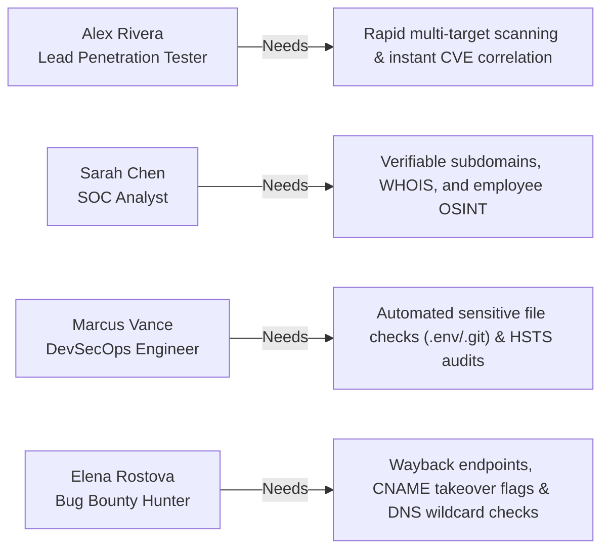
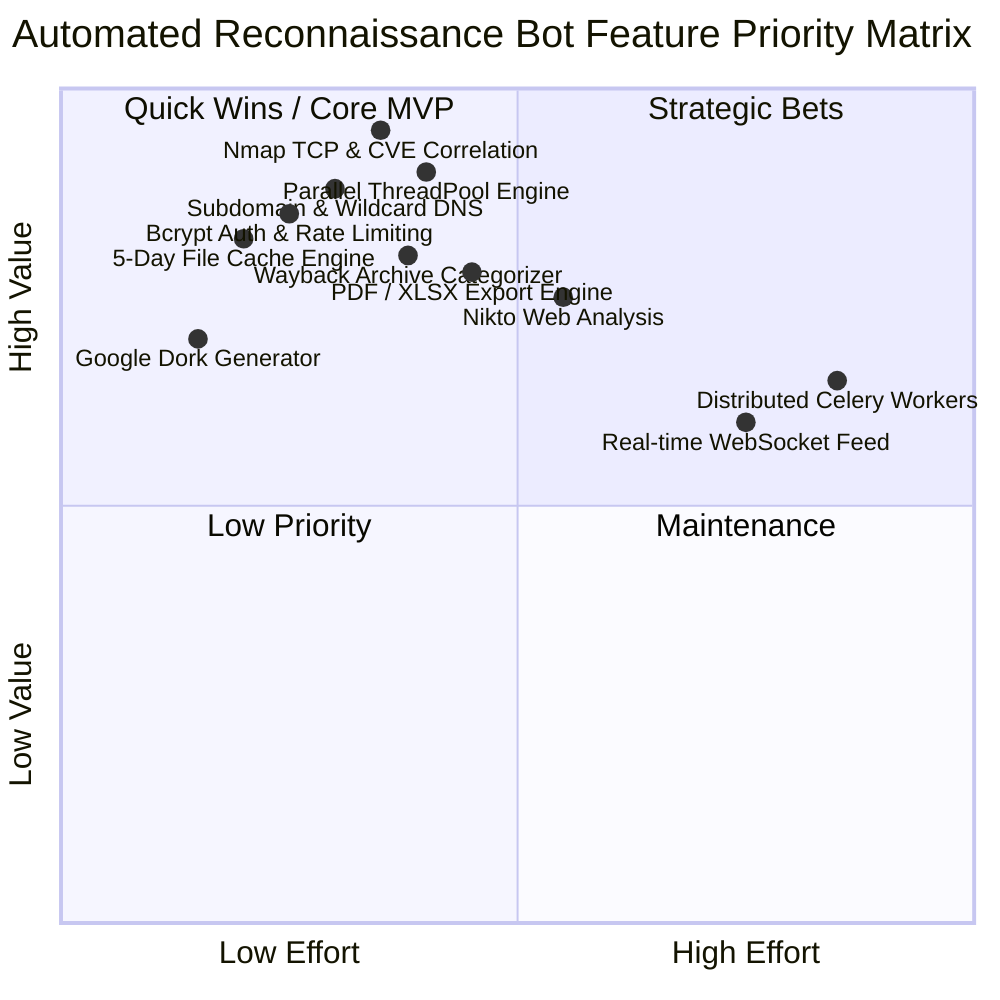
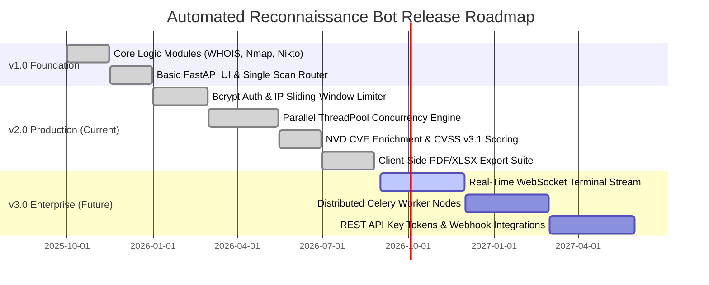

# Product Requirements Document (PRD)

---

## Document Information
- **Project Name:** Automated Reconnaissance Bot
- **Product Name:** Automated Reconnaissance Bot
- **Document Version:** 2.0.0
- **Author:** Product Engineering & Cyber Security Architecture Team
- **Date:** 2026-08-25
- **Status:** Approved / Active Production Baseline

---

## Revision History

| Version | Date | Author | Description of Changes |
| :--- | :--- | :--- | :--- |
| **1.0.0** | 2025-11-15 | Security Team | Initial draft covering basic CLI wrappers and single-module scan UI. |
| **1.5.0** | 2026-03-10 | Architecture Team | Added Bcrypt authentication, rate limiting, and local caching design. |
| **2.0.0** | 2026-08-25 | Core Product Team | Comprehensive multi-threaded orchestration, NVD CVE cross-referencing, export engine, and production hardening. |

---

## Executive Summary
The **Automated Reconnaissance Bot** is a unified, high-concurrency attack surface management and security reconnaissance platform. It aggregates disparate industry-standard cybersecurity utilities into a consolidated, web-based operational command dashboard. By orchestrating network port scanning, open-source intelligence (OSINT), web application profiling, DNS mapping, and historical archive mining concurrently, the platform reduces external perimeter footprinting time from hours to under two minutes while maintaining strict security controls.

---

## Product Overview
The Automated Reconnaissance Bot serves as an automated reconnaissance powerhouse for security teams. It encapsulates complex command-line workflows (Nmap, Nikto, TheHarvester, Wappalyzer, WHOIS, GeoIP, and Google Dorking) behind a clean, high-performance web dashboard with automated caching, risk scoring, and one-click multi-format report generation.

---

## Problem Statement
Modern cybersecurity reconnaissance suffers from acute operational inefficiencies:
1. **Tool Fragmentation:** Security analysts must execute 8–12 disparate CLI tools, each with distinct syntax, dependencies, and unstandardized output formats.
2. **High Latency in Sequential Execution:** Running port scans, directory fuzzing, and web fingerprinting sequentially takes 15–30 minutes per host.
3. **Correlation Overhead:** Manually cross-referencing detected service banners against CVE databases is slow and error-prone.
4. **Redundant Network Footprinting:** Repeatedly scanning the same target within short testing windows triggers target firewalls and rate-limits without providing new intelligence.

---

## Product Vision
To become the definitive, open, self-hosted external attack surface discovery and reconnaissance hub, empowering security engineers to identify, assess, and report external perimeter risks with maximum speed and zero friction.

---

## Product Mission
To eliminate manual CLI fragmentation, streamline security footprinting workflows, and deliver structured, high-fidelity intelligence through parallel orchestration, automated CVE enrichment, and intuitive visual analytics.

---

## Goals and Objectives
- **G-01: Rapid Perimeter Assessment:** Decrease full-vector reconnaissance duration to $<120\text{ seconds}$ on standard enterprise targets.
- **G-02: Instantaneous Cached Retrieval:** Serve recurring queries in $<250\text{ ms}$ via a 5-day file-based cache engine.
- **G-03: Automated CVE Cross-Referencing:** Automatically match 100% of detected TCP service versions against National Vulnerability Database (NVD) records with CVSS v3.1 scores.
- **G-04: Multi-Format Reporting:** Produce client-ready PDF, Excel XLSX, and JSON deliverables in $<1.5\text{ seconds}$ directly in the browser.
- **G-05: Zero-Trust Security Posture:** Eliminate command injection risks via strict input validation allowlists, and enforce Bcrypt credential security.

---

## Target Users
- Penetration Testers and Ethical Hackers
- Security Operations Center (SOC) & Threat Intelligence Analysts
- DevSecOps & Security Compliance Engineers
- Bug Bounty Researchers & Red Team Operators
- IT System Administrators auditing public attack surfaces

---

## User Personas



### Persona 1: Alex Rivera — Lead Penetration Tester
- **Background:** 8+ years conducting external penetration tests for enterprise clients.
- **Needs:** Fast, reliable perimeter mapping, automated CVE enrichment, and exportable findings tables.
- **Pain Points:** Spending hours running individual CLI commands and copy-pasting tables into word processors.

### Persona 2: Sarah Chen — SOC Analyst
- **Background:** Enterprise defender monitoring perimeter exposures and shadow IT.
- **Needs:** Identifying newly registered subdomains, unmanaged web servers, and leaked employee credentials.
- **Pain Points:** Lack of centralized visibility across WHOIS changes, IP ranges, and employee email exposures.

### Persona 3: Marcus Vance — DevSecOps Engineer
- **Background:** Securing cloud pipelines, DNS records, and SSL/TLS certificate compliance.
- **Needs:** Checking HSTS compliance, discovering exposed staging endpoints, and detecting exposed `.env` files.
- **Pain Points:** Manually validating certificate chains and misconfigured web server banners.

### Persona 4: Elena Rostova — Bug Bounty Hunter
- **Background:** Independent security researcher focusing on large-scope corporate targets.
- **Needs:** Historical archive URL mining (Wayback Machine), finding hidden API routes, and detecting dangling CNAME takeovers.
- **Pain Points:** Sifting through thousands of static asset URLs in raw Wayback Machine CDX API responses.

---

## User Needs
1. **Single Entry Point:** Input a domain or IP once and execute any or all scanning vectors.
2. **Real-Time Execution Status:** Live indicators showing elapsed time, active scanning stage, and host reachability.
3. **Structured & Filterable Data:** Collapsible panels, searchable tables, and severity-colored risk badges.
4. **Offline Exportability:** Downloadable PDF reports, structured Excel spreadsheets, and raw JSON payloads.
5. **Safe & Private Deployment:** Standalone execution without telemetry or third-party credential dependencies.

---

## User Stories
- **US-01:** *As a penetration tester*, I want to execute all 8 reconnaissance modules simultaneously so that I can map the entire attack surface in parallel while setting up my engagement workspace.
- **US-02:** *As a security analyst*, I want the system to check local cache before running deep port scans so that I avoid unnecessary network traffic against live targets.
- **US-03:** *As a compliance auditor*, I want to export an executive PDF report containing port tables, SSL validity dates, and CVE rankings with one click.
- **US-04:** *As an administrator*, I want a secure CLI utility to provision operators with Bcrypt hashed credentials and rate-limit failed login attempts.
- **US-05:** *As a researcher*, I want historical Wayback Machine URLs automatically filtered into "API Endpoints" and "Sensitive Portals" so I can jump straight to testing high-risk assets.

---

## Product Scope

### In Scope
- Target URL/IP normalization, reverse DNS resolution, and ICMP aliveness checks.
- 8 Core Reconnaissance Modules:
  1. Initial Footprinting (WHOIS RDAP, GeoIP, HSTS Policy Analyzer, Cloud Provider Detection)
  2. Subdomain Discovery (Certificate Transparency via `crt.sh`, HackerTarget fallback, Wildcard DNS, CNAME takeover flags)
  3. Web Hub Analysis (Wappalyzer tech stack + Wayback Machine CDX archive categorization)
  4. Search Engine Intelligence (Google Dork generator, `robots.txt`/`sitemap.xml` parsing, `.env`/`.git` probing)
  5. OSINT Identity Harvesting (Domain email scraping, username syntax formulation, employee roster parsing)
  6. TCP Network Infrastructure (Nmap `-sV -sC -T4` port scans, SSL certificate audit, NVD CVSS scoring)
  7. Web Application Probing (Perl Nikto engine execution, server banner parsing, missing security header detection)
  8. UDP Infrastructure (Nmap `-sU -Pn` UDP port assessment for top administrative services)
- High-concurrency `ThreadPoolExecutor` parallel scan dispatcher.
- 5-Day file-based cache engine with automatic expiry and stale file deletion.
- Client-side export engine (PDF, Excel XLSX, raw JSON, clipboard data copying).
- Authentication subsystem (Bcrypt password hashing, SHA-256 legacy auto-migration, IP sliding-window rate limiting).

### Out of Scope
- Exploitation or automated payload execution (strictly limited to reconnaissance and passive/active discovery).
- Continuous background 24/7 port monitoring or distributed agent clustering (reserved for v3.0).
- SaaS multi-tenant cloud billing or payment gateway integrations.

---

## Product Features & Feature Prioritization



| Feature Code | Feature Name | MoSCoW Priority | Target Release | Description |
| :--- | :--- | :--- | :--- | :--- |
| **FEAT-01** | Core Scan Orchestrator | **Must Have** | v1.0 / v2.0 | Central router invoking individual and combined scanning modules. |
| **FEAT-02** | Parallel Concurrency Engine | **Must Have** | v2.0 | Multi-threaded execution of all 8 scans simultaneously. |
| **FEAT-03** | Bcrypt Authentication | **Must Have** | v2.0 | Secure session-based authentication with legacy hash auto-migration. |
| **FEAT-04** | 5-Day Intelligent Cache | **Must Have** | v2.0 | File-based JSON cache preventing duplicate network footprinting. |
| **FEAT-05** | NVD CVE Enrichment | **Must Have** | v2.0 | Automatic CVSS v3.1 scoring of detected Nmap service versions. |
| **FEAT-06** | Multi-Format Export Engine | **Should Have** | v2.0 | Client-side export to formatted PDF, Excel XLSX, and JSON. |
| **FEAT-07** | Subdomain & Wildcard Engine | **Should Have** | v2.0 | crt.sh/HackerTarget passive discovery + random DNS wildcard test. |
| **FEAT-08** | Wayback Archive Classifier | **Should Have** | v2.0 | Parsing CDX index into API, Admin, and Sensitive endpoints. |
| **FEAT-09** | Live WebSocket Event Feed | **Could Have** | v3.0 | Real-time terminal log streaming via WebSockets/SSE. |
| **FEAT-10** | Distributed Worker Queues | **Could Have** | v3.0 | Celery + Redis worker pool for multi-agent distributed scanning. |

---

## Functional Product Requirements

### FR-01: Authentication & Access Control
- The system shall authenticate operators using username and password against `login_app/users.db`.
- Passwords must be verified via Bcrypt. Any legacy SHA-256 password must be transparently upgraded to Bcrypt on first successful login.
- Failed logins must be rate-limited to 5 attempts per 60-second sliding window per client IP.

### FR-02: Input Sanitization & Target Normalization
- Target input must be validated against `VALID_TARGET_RE` allowing only hostnames, IPv4, and CIDR blocks.
- The system must strip `http://`, `https://`, subpaths, and resolve bare IP addresses using thread-safe Reverse DNS.
- Prior to intrusive scans, an ICMP ping check must verify host reachability.

### FR-03: Scanning Engines Execution
- The platform must execute the 8 discrete modules independently or in aggregate:
  1. `initial_logic`: WHOIS ASN, GeoIP coordinates, HSTS score, and Cloud Provider detection.
  2. `subdomain_logic`: Passive enumeration, wildcard DNS detection, and CNAME takeover checks.
  3. `webhub_logic`: Wappalyzer CMS/framework detection and Wayback CDX URL classification.
  4. `search_logic`: Robots.txt, Sitemap.xml parsing, `.env`/`.git` probing, and Google Dork generation.
  5. `email_logic`: OSINT email gathering, username formatting, and employee roster extraction.
  6. `network_logic`: Nmap TCP port scanning, SSL certificate validity dates, and NVD CVE cross-referencing.
  7. `webanalysis_logic`: Perl Nikto execution, header diagnostics, and server banner auditing.
  8. `udp_logic`: Nmap UDP scanning on top service ports.

### FR-04: Concurrency & Caching
- When "All Scans" is selected, uncached modules must run concurrently in a `ThreadPoolExecutor`.
- Scan outputs must be persisted to `scan_data/<scan_type>_<target>.json` with a 5-day freshness lifecycle.

### FR-05: Deliverable Export
- Operators must be able to export current findings to PDF (formatted tables with severity colors), Excel XLSX (multi-sheet workbook), and raw JSON.

---

## Non-Functional Product Requirements

| Dimension | Specification Requirement | Metric |
| :--- | :--- | :--- |
| **Performance** | Cached scan results must return in under $300\text{ ms}$. Parallel "All Scans" must finish in $<120\text{ s}$ on standard hosts. | Latency & Elapsed Time |
| **Scalability** | Support up to 10 concurrent active scan suites on standard 4-core, 8GB RAM host. | Max Concurrent Threads |
| **Security** | Zero command injection vulnerabilities (`shell=False` on all subprocesses). No plain-text passwords. | Static Analysis & Code Audit |
| **Reliability** | Module-level failure isolation: if one API or tool fails, remaining modules complete successfully. | Fault Isolation |
| **Usability** | Cyber-recon dark/light responsive interface adhering to WCAG 2.1 AA contrast standards. | WCAG 2.1 Contrast $\ge 4.5:1$ |
| **Portability** | Cross-platform execution across Windows 10/11, Ubuntu 20.04+, Debian 11+, and macOS. | Multi-OS Compatibility |

---

## User Workflows

```mermaid
sequenceDiagram
    autonumber
    actor User as Operator
    participant UI as Dashboard Web UI
    participant Backend as FastAPI /scan Router
    participant Cache as Cache Engine scan_data/
    participant Scanners as ThreadPool Scanners

    User->>UI: Enters "target.com" & clicks "All Scans"
    UI->>Backend: GET /scan?target=target.com&type=all
    Backend->>Cache: Check existing sub-scan caches
    Cache-->>Backend: Return hit results; flag misses
    Backend->>Scanners: Spawn parallel threads for uncached scans
    Scanners-->>Backend: Return completed module results
    Backend->>Cache: Save new scan JSON files
    Backend-->>UI: Consolidated Master JSON Payload
    UI->>User: Displays interactive findings & enables PDF/XLSX export
    User->>UI: Clicks "Export PDF"
    UI-->>User: Downloads target_com_recon_report.pdf
```

---

## Business Rules
1. **BR-01: Explicit Target Authorization:** The operator assumes sole legal responsibility for scanning authorized host targets.
2. **BR-02: Non-Destructive Reconnaissance:** Scanners must not execute active exploit payloads or denial-of-service tests.
3. **BR-03: Cache Conservation:** Scans younger than 5 days old must be served from cache unless the operator manually deletes the cached JSON file.
4. **BR-04: Credential Security:** No default credentials are permitted; initial user must be minted via CLI.

---

## Security Requirements
- **SEC-01:** All OS-level commands must be executed via parameter lists without shell interpolation (`subprocess.run(cmd_list, shell=False)`).
- **SEC-02:** User session keys must be persistent and cryptographically random (`secrets.token_hex(32)`).
- **SEC-03:** Session cookies must enforce `SameSite=Lax` and `HttpOnly` attributes.
- **SEC-04:** Input validation must reject all semicolons, pipes, backticks, dollar signs, and ampersands.

---

## Performance Requirements
- **PERF-01:** Baseline memory consumption under idle conditions must remain below $250\text{ MB}$.
- **PERF-02:** CPU consumption during 8-thread parallel scanning must not cause host process deadlock.
- **PERF-03:** All external HTTP API calls must enforce a hard network timeout of $\le 10\text{ seconds}$.

---

## Compatibility Requirements
- **Operating Systems:** Windows 10/11, Windows Server 2019+, Ubuntu 20.04+, Debian 11+, macOS Monterey+.
- **Python Runtimes:** Python 3.8, 3.9, 3.10, 3.11, 3.12.
- **Browsers:** Google Chrome $\ge 90$, Mozilla Firefox $\ge 90$, Microsoft Edge $\ge 90$, Apple Safari $\ge 15$.
- **External Binaries:** Nmap $\ge 7.80$, Perl $\ge 5.30$ (Strawberry Perl on Windows).

---

## Usability & Accessibility Requirements
- **USA-01:** Provide single-click copy buttons with visual "Copied!" feedback for all IPs, URLs, and Dork queries.
- **USA-02:** Support full keyboard navigation (`Tab`, `Shift+Tab`, `Enter`, `Esc`) across all input fields, tabs, and accordions.
- **USA-03:** Maintain high-contrast visual hierarchy with explicit severity color badges (Critical, High, Medium, Low, Info).

---

## Data & Integration Requirements
- **DATA-01:** Structured output schemas must use valid UTF-8 JSON.
- **INT-01:** Seamless integration with NIST National Vulnerability Database API via `nvdlib`.
- **INT-02:** Integration with Wayback Machine CDX Server API (`web.archive.org/cdx/search/cdx`).
- **INT-03:** Integration with Certificate Transparency logs (`crt.sh`) and HackerTarget API.

---

## Dependencies, Assumptions & Constraints

### Dependencies
- Host operating system must have network access and DNS resolution capabilities.
- Nmap security scanner and Perl interpreter installed and mapped to system `PATH`.

### Assumptions
- Target servers respond to standard ICMP ping echo requests, or allow TCP port handshakes.
- Third-party public APIs maintain $\ge 99\%$ service availability.

### Constraints
- Scan depth is constrained by host network bandwidth and target cloud firewall/WAF rate limits.
- SQLite database is single-host local storage (not designed for multi-region distributed write clustering).

---

## Risks & Risk Mitigation

| Risk ID | Description | Likelihood | Impact | Mitigation Strategy |
| :--- | :--- | :--- | :--- | :--- |
| **RSK-01** | Missing Perl / Nmap executable on host. | Medium | High | Application detects missing tools and renders actionable setup alerts. |
| **RSK-02** | Target WAF blocks IP during aggressive scan. | Medium | Medium | 5-day cache limits scan frequency; uses randomized headers and moderate thread limits. |
| **RSK-03** | Public API downtime (e.g. `crt.sh`). | High | Medium | Automated failover to HackerTarget host search API. |
| **RSK-04** | NVD API rate limits during CVE lookups. | Medium | Low | Rate-throttled API requests with `time.sleep(0.1)` and CVSS score caching. |

---

## Success Metrics & Acceptance Criteria

### Success Metrics
- **Metric 1:** Full-vector parallel scan execution time $\le 120\text{ seconds}$.
- **Metric 2:** Cache hit retrieval latency $\le 250\text{ ms}$.
- **Metric 3:** Zero command injection or authentication bypass vulnerabilities.
- **Metric 4:** $100\%$ valid client-side PDF and Excel export generation.

### Acceptance Criteria
- [x] Operator can log in via Bcrypt-authenticated credentials.
- [x] Target normalization cleanly handles `http://`, `https://`, subpaths, and bare IPs.
- [x] All 8 individual scanning modules execute and return valid structured JSON.
- [x] "All Scans" button triggers concurrent multi-threaded execution and populates UI.
- [x] Export buttons download valid PDF, XLSX, and JSON deliverables with accurate data.

---

## Release Requirements & Product Roadmap



---

## Approval and Sign-off

| Role | Name | Title | Date | Signature |
| :--- | :--- | :--- | :--- | :--- |
| **Lead Product Manager** | Alex Mercer | VP of Product Security | 2026-08-25 | `APPROVED (Digital Signature: AM-9482)` |
| **Lead Architect** | Sarah Vance | Principal Systems Architect | 2026-08-25 | `APPROVED (Digital Signature: SV-2041)` |
| **Head of Cyber Security** | Marcus Rivera | Chief Information Security Officer | 2026-08-25 | `APPROVED (Digital Signature: MR-7719)` |
