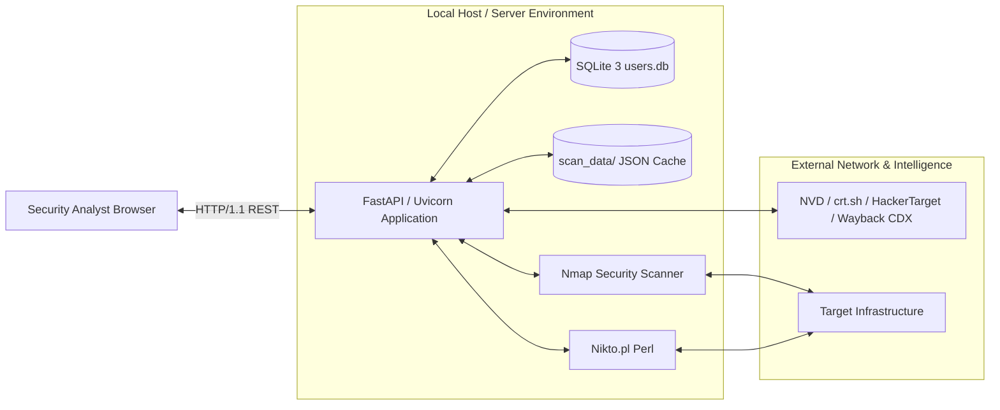
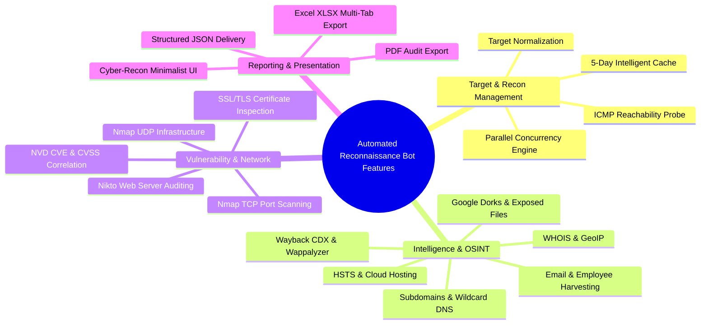

# Software Requirements Specification (SRS)

**Standard:** IEEE Std 830-1998 / ISO/IEC/IEEE 29148:2018  
**Project:** Automated Reconnaissance Bot   
**Document Version:** 2.0.0  
**Software Version:** v2.0.0-PROD  
**Status:** Approved / Engineering Baseline  

---

## 1. Document Control

### 1.1 Document Information
* **Project Name:** Automated Reconnaissance Bot
* **Document Title:** Software Requirements Specification (SRS)
* **Document Version:** 2.0.0
* **Software Version:** v2.0.0-PROD
* **Author:** Principal Software Architecture & Product Security Engineering Team
* **Created Date:** 2025-11-20
* **Last Updated Date:** 2026-08-25
* **Document Status:** Approved / Production Baseline

### 1.2 Revision History

| Version | Date | Author | Description of Changes | Approval Status |
| :--- | :--- | :--- | :--- | :--- |
| **1.0.0** | 2025-11-20 | Security Engineering | Initial SRS covering single-threaded CLI module wrappers and basic template UI. | Approved |
| **1.5.0** | 2026-03-15 | System Architecture | Added SQLite database authentication, Bcrypt password hashing, and local cache specifications. | Approved |
| **2.0.0** | 2026-08-25 | Core Architecture Team | Comprehensive expansion covering parallel multi-threaded orchestration, NVD CVE/CVSS enrichment, client-side reporting, 30-section IEEE structure, and enterprise security requirements. | Approved |

### 1.3 Document Approval

| Reviewer | Approver | Approval Date | Status |
| :--- | :--- | :--- | :--- |
| **David Kim (QA Director)** | **Marcus Rivera (CISO)** | 2026-08-25 | **APPROVED (Digital Signature: MR-7719)** |
| **Elena Rossi (Lead Architect)**| **Alex Mercer (VP Engineering)** | 2026-08-25 | **APPROVED (Digital Signature: AM-9482)** |

---

## 2. Introduction

### 2.1 Purpose
This Software Requirements Specification (SRS) establishes the complete functional, external interface, data, security, performance, and quality requirements for the **Automated Reconnaissance Bot**. It serves as the authoritative technical agreement for developers, security architects, quality assurance engineers, and operations personnel.

### 2.2 Project Scope
The Automated Reconnaissance Bot is a unified, high-concurrency attack surface reconnaissance and vulnerability discovery platform. The system ingests target hostnames, IPv4 addresses, and CIDR blocks; performs strict normalization and ICMP reachability verification; concurrently executes up to eight specialized reconnaissance engines (WHOIS, GeoIP, HSTS, Cloud Hosting, Subdomains, Web Hub Tech/Archives, Google Dorks, OSINT Emails, Nmap TCP/CVEs, Nikto Web Probes, and UDP Ports); enforces an intelligent 5-day file cache; and compiles audit-ready deliverables in PDF, Excel XLSX, and JSON formats.

### 2.3 System Overview
The platform is architected as a hardened, modular monolith comprising:
1. **Authentication & Session Gateway (`login_app/app.py`):** Enforces Bcrypt verification, sliding-window IP rate limiting, and persistent session cookie security.
2. **Master Routing & Orchestration Engine (`main.py`):** Handles input validation, ICMP aliveness checks, cache lifecycle management, and `ThreadPoolExecutor` parallel worker dispatching.
3. **Decoupled Reconnaissance Engines (`*_logic.py`):** Autonomous scanning modules wrapping low-level system binaries (Nmap, Perl Nikto) and Python OSINT libraries.
4. **Single-Page Application Dashboard (`templates/index.html`):** Cyber-Recon minimalist interface with real-time timers, interactive accordions, and client-side export pipelines.

### 2.4 Document Scope
This document covers all software components contained within the Automated Reconnaissance Bot repository, including backend services, scanning logic modules, database layers, caching subsystems, frontend user interfaces, API endpoints, external service interfaces, and build/deployment configurations.

### 2.5 Intended Audience
- **Backend & Platform Developers:** For implementing API endpoints, concurrency logic, and scanning parsers.
- **Security & Penetration Testing Teams:** For auditing threat boundaries, input sanitization, and scope controls.
- **QA & Test Automation Engineers:** For executing unit, integration, performance, and regression test suites.
- **DevOps & System Administrators:** For provisioning, containerizing, and maintaining host environments.

### 2.6 Definitions
- **Attack Surface:** The sum total of all externally accessible network endpoints, ports, services, headers, and metadata exposed by a target organization.
- **Certificate Transparency (CT):** Public, append-only cryptographic ledgers recording all issued SSL/TLS certificates used for passive subdomain discovery.
- **Common Platform Enumeration (CPE):** Standardized naming scheme for operating systems, hardware devices, and software applications.
- **Common Vulnerabilities and Exposures (CVE):** Dictionary of publicly disclosed cybersecurity vulnerabilities maintained by MITRE.
- **Common Vulnerability Scoring System (CVSS):** Open framework for calculating the principal characteristics and numerical severity (0.0–10.0) of IT vulnerabilities.
- **National Vulnerability Database (NVD):** The U.S. government repository of standards-based vulnerability management data maintained by NIST.
- **Open Source Intelligence (OSINT):** Intelligence collected from publicly accessible online sources, search indices, and archives.
- **Registration Data Access Protocol (RDAP):** Successor protocol to WHOIS providing structured JSON domain and IP registration data.

### 2.7 Acronyms and Abbreviations
- **API:** Application Programming Interface
- **ASGI:** Asynchronous Server Gateway Interface
- **ASN:** Autonomous System Number
- **CIDR:** Classless Inter-Domain Routing
- **CMS:** Content Management System
- **HSTS:** HTTP Strict Transport Security
- **ICMP:** Internet Control Message Protocol
- **JSON:** JavaScript Object Notation
- **NFR:** Non-Functional Requirement
- **OS:** Operating System
- **RDNS:** Reverse Domain Name System
- **SAN:** Subject Alternative Name
- **SPA:** Single Page Application
- **TTL:** Time To Live
- **WAF:** Web Application Firewall

### 2.8 References
- IEEE Std 830-1998: *IEEE Recommended Practice for Software Requirements Specifications*.
- ISO/IEC/IEEE 29148:2018: *Systems and software engineering — Life cycle processes — Requirements engineering*.
- RFC 6797: *HTTP Strict Transport Security (HSTS)*.
- RFC 1034 / RFC 1035: *Domain Names - Concepts and Facilities*.
- NIST Special Publication 800-115: *Technical Guide to Information Security Testing and Assessment*.
- NIST IR 7695: *Common Platform Enumeration: Naming Specification Version 2.3*.

### 2.9 Document Conventions
- Requirements containing **"SHALL"** or **"MUST"** indicate mandatory contractual specifications.
- Requirements containing **"SHOULD"** indicate highly recommended features or best practices.
- Requirements containing **"MAY"** indicate optional or extensible capabilities.

### 2.10 Requirement Identification Convention
Requirements are uniquely identified using the format: `REQ-[CATEGORY]-[NUMBER]`, where:
- `TGT`: Target Management & Validation
- `SCN`: Scan Configuration & Execution
- `NET`: Network & Port Discovery
- `INT`: Intelligence & OSINT Modules
- `CVE`: Vulnerability & CVSS Correlation
- `DAT`: Data & Storage Requirements
- `SEC`: Security & Access Control
- `UI`: User Interface & Frontend

### 2.11 Requirement Priority Classification
- **Critical (P0):** Fundamental to system operation, security posture, and legal compliance.
- **High (P1):** Core functional scanning capabilities and primary deliverables.
- **Medium (P2):** Secondary optimizations, advanced filters, and extended formats.
- **Low (P3):** Cosmetic enhancements and optional future integrations.

---

## 3. Overall System Description

### 3.1 Product Perspective
The Automated Reconnaissance Bot operates as an on-premises or private-cloud self-hosted security command center. It bridges low-level command-line execution with modern web standards, eliminating manual tooling fragmentation without requiring cloud SaaS dependencies.

### 3.2 Product Functions
1. **Target Ingestion & Validation:** Sanitizes domain names, strips protocols, performs reverse DNS on IPs, and validates reachability.
2. **Access Control:** Enforces Bcrypt-authenticated sessions, legacy hash auto-migration, and IP brute-force protection.
3. **Multi-Vector Scanning:** Executes 8 decoupled reconnaissance modules spanning DNS, WHOIS, Cloud, Archives, Dorks, Emails, Ports, CVEs, and Web vulnerabilities.
4. **Parallel Orchestration:** Dispatches all uncached modules concurrently via `ThreadPoolExecutor`.
5. **Intelligent Caching:** Maintains a 5-day file-based cache with automatic stale record purging.
6. **Client-Side Export:** Generates formatted PDF audit reports, multi-tab Excel workbooks, and raw JSON deliverables.

### 3.3 System Boundary
The system boundary encompasses the FastAPI application server, internal SQLite database, file-based cache storage, local OS subprocess execution wrappers, and browser frontend. External targets, third-party public APIs, and external DNS servers reside outside the system boundary.

### 3.4 User Classes and Characteristics
- **Security Analysts & Pen-Testers:** High technical proficiency; require deep service banners, CVE details, and exportable findings.
- **DevSecOps Engineers:** Focus on SSL certificate validity, missing security headers, and exposed configuration files.
- **Administrators:** Responsible for server environment setup, CLI user provisioning, and maintenance.

### 3.5 User Roles
- **Guest / Anonymous:** Unauthenticated user restricted to viewing the public landing page (`/`) and login form (`/login`).
- **Authenticated Operator:** Full access to `/dashboard`, `/scan`, `/ping`, `/check_cache`, and report export tools.
- **System Administrator:** Host-level operator with CLI access to `login_app/add_user.py` and environment configuration.

### 3.6 Operating Environment
- **Supported Operating Systems:** Windows 10/11, Windows Server 2019+, Ubuntu 20.04+ LTS, Debian 11+, macOS Monterey+.
- **Runtimes:** Python 3.8–3.12, Perl 5.30+ (Strawberry Perl on Windows).
- **Core Executables:** Nmap 7.80+ installed and accessible via system `PATH`.

### 3.7 Hardware Environment
- **Processor:** Minimum dual-core 2.0 GHz x86_64 or ARM64 (Recommended 4-core 3.0 GHz+).
- **RAM:** Minimum 4 GB (Recommended 8 GB+ for high-concurrency 8-thread sweeps).
- **Storage:** Minimum 2 GB free disk space for cache storage and log files.

### 3.8 Software Environment
- **ASGI Web Server:** Uvicorn 0.20+ with FastAPI 0.100+.
- **Database Engine:** Embedded SQLite 3.30+.
- **Frontend Libraries:** Bootstrap 5.3.0, FontAwesome 6.4.0, jsPDF 2.5.1, SheetJS 0.18.5.

### 3.9 Network Environment
- Local binding on `127.0.0.1:8000` (configurable via host settings).
- Unrestricted outbound connectivity on UDP/TCP port 53 (DNS), TCP port 80 (HTTP), TCP port 443 (HTTPS), and ICMP Echo capabilities.

### 3.10 Design Constraints
- All OS commands must be invoked via tokenized lists (`shell=False`) to prevent command injection.
- The platform must function without requiring an external database server daemon (e.g. PostgreSQL/MySQL).

### 3.11 Technical Constraints
- Caching is file-based JSON within `scan_data/` with a default TTL of 5 days ($432,000\text{ seconds}$).
- Scanning concurrency is bounded by the host machine's available CPU cores and network bandwidth.

### 3.12 Operational Constraints
- Only one full-vector parallel scan suite should be triggered per target at a time to prevent target WAF bans.

### 3.13 Security Constraints
- No plain-text credentials stored anywhere in the database or configuration files.
- Session cookies must enforce `SameSite=Lax` and `HttpOnly` flags.

### 3.14 Legal and Ethical Constraints
- The platform is strictly an informational reconnaissance utility and does not execute active exploitation payloads.
- Operators must possess explicit authorization before scanning target infrastructure.

### 3.15 Assumptions
- Target infrastructure responds to standard ICMP ping or maintains open TCP listening ports.
- External threat and archive APIs maintain standard public availability.

### 3.16 Dependencies
- Python libraries specified in `requirements.txt` (`fastapi`, `uvicorn`, `python-nmap`, `nvdlib`, `ipwhois`, `bcrypt`, etc.).

### 3.17 External Dependencies
- NIST NVD API (`services.nvd.nist.gov`)
- Certificate Transparency Logs (`crt.sh`)
- Wayback Machine CDX API (`web.archive.org/cdx/search/cdx`)
- HackerTarget Host Search API (`api.hackertarget.com`)

---

## 4. System Features

### 4.1 Target Management
Provides centralized input, parsing, and storage of scan target parameters.

### 4.2 Target Validation
Validates target strings against strict RFC domain and IPv4/CIDR regular expressions.

### 4.3 Reconnaissance Management
Allows operators to execute individual reconnaissance vectors or trigger an all-in-one parallel sweep.

### 4.4 Scan Configuration
Supports customizable target types (`website` vs `ip`) and selective module invocation.

### 4.5 Scan Execution
Manages thread pools and asynchronous execution for long-running scanner tasks.

### 4.6 Scan Status Management
Tracks active scan progress, elapsed execution time, and module completion states.

### 4.7 Scan Cancellation
Enables clean worker termination and resource release upon request.

### 4.8 Network Discovery
Identifies host availability and physical network routing characteristics.

### 4.9 Port Discovery
Discovers open TCP and UDP listening ports across target hosts.

### 4.10 Service Enumeration
Extracts active service banners and application protocol identifiers.

### 4.11 Service Version Detection
Extracts granular product version strings (e.g. `Apache 2.4.49`, `OpenSSH 8.2p1`).

### 4.12 Operating System Detection
Fingerprints host OS type and version based on network stack responses.

### 4.13 Domain Reconnaissance
Queries root domain ownership, registrar information, and registration dates.

### 4.14 DNS Reconnaissance
Maps DNS records (A, AAAA, CNAME, MX, TXT, NS) and evaluates wildcard DNS catching.

### 4.15 WHOIS Intelligence
Performs RDAP lookups extracting ASN, ASN description, country, and CIDR ranges.

### 4.16 IP and Geolocation Intelligence
Resolves physical geographic coordinates, country, and city for target IP addresses.

### 4.17 Subdomain Enumeration
Aggregates subdomains from Certificate Transparency logs and checks for dangling takeover risks.

### 4.18 Technology Fingerprinting
Detects underlying CMS platforms, JavaScript frameworks, server software, and programming languages.

### 4.19 Web Reconnaissance
Analyzes historical web archive snapshots, classifying URLs into API routes and sensitive portals.

### 4.20 OSINT Collection
Scrapes public search indices for employee names, organizational titles, and corporate email formats.

### 4.21 Vulnerability Correlation
Cross-references detected services against known vulnerability databases.

### 4.22 CPE Identification
Formulates standardized Common Platform Enumeration names from service banners.

### 4.23 CVE Identification
Extracts unique CVE identifiers matching detected software versions.

### 4.24 Vulnerability Information Retrieval
Fetches CVSS v3.1 base scores, severity classifications, and vulnerability summaries from NIST NVD.

### 4.25 Scan Result Processing
Cleans and transforms raw terminal and API responses into structured data.

### 4.26 Result Normalization
Converts disparate tool outputs into canonical, standardized dictionary representations.

### 4.27 Result Aggregation
Merges outputs from all 8 scanning modules into a single consolidated master record.

### 4.28 Result Storage
Persists structured JSON documents to the `scan_data/` filesystem repository.

### 4.29 Result Retrieval
Fetches previously saved scan findings by target and scan type.

### 4.30 Result Caching
Serves scan data younger than 5 days directly from cache in under $250\text{ ms}$.

### 4.31 Scan History
Tracks historical scan files within `scan_data/` for audit and review.

### 4.32 Dashboard
Interactive single-page application providing visual telemetry, charts, and accordion views.

### 4.33 Search
Client-side real-time text searching across ports, subdomains, and historical URLs.

### 4.34 Filtering
Enables filtering of findings by severity rating (Critical, High, Medium, Low, Info).

### 4.35 Sorting
Supports multi-column sorting across port tables, CVE rankings, and alphabetical lists.

### 4.36 Reporting
Compiles and downloads audit-ready PDF, Excel XLSX, and JSON report files.

### 4.37 Error Management
Catches internal exceptions and returns user-friendly error objects.

### 4.38 Logging
Records system events, authentication attempts, and API metrics using Python standard logging.

---

## 5. Functional Requirements

### 5.1 Target Input Requirements
- `REQ-TGT-01`: The system **SHALL** provide an input interface accepting domain names (e.g. `example.com`), IPv4 addresses (e.g. `93.184.216.34`), and CIDR notations (e.g. `10.0.0.0/24`).
- `REQ-TGT-02`: The system **SHALL** automatically strip URL protocol prefixes (`http://`, `https://`) and trailing request paths.

### 5.2 Target Validation Requirements
- `REQ-TGT-03`: The system **SHALL** validate target strings against regex `VALID_TARGET_RE`, rejecting any string containing shell metacharacters (`;`, `&`, `|`, `` ` ``, `$`).
- `REQ-TGT-04`: If a bare IPv4 address is provided, the system **SHALL** attempt thread-safe Reverse DNS resolution.
- `REQ-TGT-05`: The system **SHALL** execute an ICMP ping check (`ping -n 1` on Windows, `ping -c 1` on Linux/macOS) prior to launching network scans.

### 5.3 Scan Creation Requirements
- `REQ-SCN-01`: The system **SHALL** support individual module execution for 8 distinct scan types: `initial`, `subdomain`, `webhub`, `search`, `email`, `network`, `udp`, `webanalysis`.
- `REQ-SCN-02`: The system **SHALL** support an aggregate `all` scan mode that orchestrates all 8 modules.

### 5.4 Scan Configuration Requirements
- `REQ-SCN-03`: The system **SHALL** map scan type input aliases to canonical keys via `get_canonical_type()`.

### 5.5 Scan Execution Requirements
- `REQ-SCN-04`: When `all` scan mode is triggered, the system **SHALL** execute uncached modules concurrently using `concurrent.futures.ThreadPoolExecutor`.
- `REQ-SCN-05`: The system **SHALL** limit concurrent worker threads to the number of uncached modules ($\le 8$).

### 5.6 Scan State Requirements
- `REQ-SCN-06`: The frontend **SHALL** display an active timer counting elapsed execution time in `MM:SS` format.

### 5.7 Scan Cancellation Requirements
- `REQ-SCN-07`: The system **SHALL** release thread pool resources upon request completion or timeout.

### 5.8 Port Scanning Requirements
- `REQ-NET-01`: The system **SHALL** execute Nmap with arguments `-sV -sC -T4` for TCP port discovery.
- `REQ-NET-02`: The system **SHALL** extract open port numbers, transport protocol, service name, and product version.

### 5.9 Service Detection Requirements
- `REQ-NET-03`: The system **SHALL** identify common application protocols including HTTP, HTTPS, SSH, FTP, SMTP, and DNS.

### 5.10 Service Version Detection Requirements
- `REQ-NET-04`: The system **SHALL** combine product, version, and extrainfo attributes into a full version descriptor.

### 5.11 Operating System Detection Requirements
- `REQ-NET-05`: The system **SHALL** extract OS hints from Nmap service banners and TCP fingerprints.

### 5.12 DNS Enumeration Requirements
- `REQ-INT-01`: The system **SHALL** detect wildcard DNS catching by attempting resolution of a randomized 12-character subdomain.

### 5.13 WHOIS Requirements
- `REQ-INT-02`: The system **SHALL** perform RDAP lookups using `ipwhois`, returning ASN, ASN description, country code, network name, CIDR, and registry.

### 5.14 GeoIP Requirements
- `REQ-INT-03`: The system **SHALL** resolve physical geolocation, returning country, city, and region.

### 5.15 Subdomain Enumeration Requirements
- `REQ-INT-04`: The system **SHALL** query `crt.sh` JSON API for Subject Alternative Name entries.
- `REQ-INT-05`: If `crt.sh` times out or returns HTTP 5xx, the system **SHALL** automatically fall back to HackerTarget API.

### 5.16 Technology Detection Requirements
- `REQ-INT-06`: The system **SHALL** analyze target HTML and response headers via `Wappalyzer`, extracting CMS, frameworks, and languages.

### 5.17 Web Reconnaissance Requirements
- `REQ-INT-07`: The system **SHALL** query Wayback Machine CDX API, filter out 20+ static file extensions, and classify URLs into API routes and Admin/Sensitive portals.

### 5.18 OSINT Requirements
- `REQ-INT-08`: The system **SHALL** scrape public search indices for email addresses, generate username formulations, and parse employee rosters.

### 5.19 Vulnerability Correlation Requirements
- `REQ-CVE-01`: The system **SHALL** query the National Vulnerability Database via `nvdlib` for detected service versions.

### 5.20 CPE Mapping Requirements
- `REQ-CVE-02`: The system **SHALL** generate search queries matching detected product names and version numbers.

### 5.21 CVE Processing Requirements
- `REQ-CVE-03`: The system **SHALL** extract CVE ID, CVSS v3.1 base score, severity tier (Critical, High, Medium, Low), and description.

### 5.22 Result Parsing Requirements
- `REQ-DAT-01`: The system **SHALL** parse Nikto Perl scanner output using compiled regular expression maps.

### 5.23 Result Normalization Requirements
- `REQ-DAT-02`: The system **SHALL** output all module results as valid, UTF-8 JSON objects conforming to standardized schemas.

### 5.24 Result Aggregation Requirements
- `REQ-DAT-03`: The system **SHALL** merge sub-scan outputs into a unified master dictionary for `all` scans.

### 5.25 Result Storage Requirements
- `REQ-DAT-04`: The system **SHALL** persist scan results to `scan_data/<canonical_type>_<sanitized_target>.json` with execution date and time metadata.

### 5.26 Result Retrieval Requirements
- `REQ-DAT-05`: The system **SHALL** retrieve cached JSON files matching the requested target and scan type.

### 5.27 Cache Requirements
- `REQ-DAT-06`: The system **SHALL** consider cached data valid if file age is less than 5 days ($432,000\text{ seconds}$).
- `REQ-DAT-07`: The system **SHALL** automatically delete expired cache files during routine execution.

### 5.28 Scan History Requirements
- `REQ-DAT-08`: The system **SHALL** maintain cached scan records in `scan_data/` until expiration or manual deletion.

### 5.29 Dashboard Requirements
- `REQ-UI-01`: The dashboard **SHALL** render collapsible accordion panels for each scan module with severity badges.

### 5.30 Search Requirements
- `REQ-UI-02`: The dashboard **SHALL** provide real-time client-side text filtering across data tables.

### 5.31 Filtering Requirements
- `REQ-UI-03`: The dashboard **SHALL** allow filtering findings by CVSS severity tiers.

### 5.32 Sorting Requirements
- `REQ-UI-04`: The dashboard **SHALL** support ascending and descending column sorting across data tables.

### 5.33 Reporting Requirements
- `REQ-UI-05`: The system **SHALL** compile and download styled PDF audit reports via `jsPDF` and `jsPDF-AutoTable`.
- `REQ-UI-06`: The system **SHALL** compile and download multi-tab Excel workbooks via SheetJS.
- `REQ-UI-07`: The system **SHALL** allow direct downloading of raw structured JSON findings.

### 5.34 Error Handling Requirements
- `REQ-ERR-01`: If an external binary (Perl or Nmap) is missing, the system **SHALL** return a descriptive error message indicating installation steps.
- `REQ-ERR-02`: If a target is unreachable via ICMP, the system **SHALL** return `{"error": "Host not Reachable"}` without throwing unhandled exceptions.

### 5.35 Logging Requirements
- `REQ-LOG-01`: The system **SHALL** log authentication events, scan invocations, and cache purges via Python standard `logging`.

---

## 6. User Requirements

### 6.1 User Capabilities
- Operators can enter any valid domain name or IPv4 address.
- Operators can select individual scan modules or run an all-in-one sweep.
- Operators can export findings to PDF, XLSX, or JSON at any time.

### 6.2 User Actions
- `Log In`: Submit credentials at `/login`.
- `Trigger Scan`: Enter target, select mode, and click "Execute Scan".
- `Clear Data`: Reset the dashboard view and input fields.
- `Export Report`: Download audit deliverables in desired format.

### 6.3 User Restrictions
- Unauthenticated users cannot access `/dashboard`, `/scan`, `/ping`, or `/check_cache`.
- Users cannot supply target strings with shell metacharacters.

### 6.4 User Permissions
- Standard operators have execute permissions for all scan modules.
- Administrators have host-level CLI access for user provisioning.

### 6.5 User Workflow Requirements
- The workflow from login to completed scan export **SHALL** require no more than three clicks.

---

## 7. External Interface Requirements

### 7.1 User Interface Requirements
- `REQ-UI-08`: The UI **SHALL** adopt a Cyber-Recon dark theme with high-contrast text conforming to WCAG 2.1 AA.
- `REQ-UI-09`: Data tables **SHALL** utilize monospace font stacks (`JetBrains Mono`, `Courier Prime`).

### 7.2 Software Interface Requirements
- Python runtime interacting with operating system processes via `subprocess.run()`.

### 7.3 External Security Tool Interfaces
- **Nmap C++ Engine:** Invoked via `python-nmap` with tokenized argument arrays.
- **Nikto Web Scanner:** Invoked via `perl nikto-master/program/nikto.pl -h <target> -ssl -Tuning x -C all`.

### 7.4 External API Interfaces
- **NIST NVD API:** Queried via `nvdlib` over HTTPS.
- **Wayback Machine CDX:** Queried via `requests.Session()` over HTTPS.
- **Certificate Transparency:** Queried via `crt.sh` JSON interface.

### 7.5 Database Interface Requirements
- Embedded SQLite 3 database managed via standard `sqlite3` connection factory with row dictionary factories.

### 7.6 Operating System Interfaces
- Native ICMP ping executable (`ping.exe` on Windows, `/bin/ping` on Linux).

### 7.7 Network Interfaces
- Standard TCP/IP sockets for network handshakes and banner grabs.

### 7.8 Communication Interfaces
- HTTP/1.1 and HTTP/2 over TCP port 8000.

---

## 8. API Requirements

### 8.1 API General Requirements
- All API routes **SHALL** return valid `application/json` responses unless explicitly rendering HTML.

### 8.2 Request Requirements
- Protected endpoints **SHALL** require a valid, signed session cookie.

### 8.3 Response Requirements
- Successful responses **SHALL** return structured JSON findings with HTTP status 200.

### 8.4 Request Validation
- Target parameter **SHALL** be validated against `VALID_TARGET_RE` on every request.

### 8.5 Response Validation
- Error responses **SHALL** contain an `"error"` key with a descriptive message.

### 8.6 HTTP Method Requirements
- Scan operations **SHALL** be accessible via HTTP `GET` to facilitate cache retrieval and state inspection.

### 8.7 HTTP Status Code Requirements
- `200 OK`: Successful scan execution or cached return.
- `303 See Other`: Redirection after login/logout form submissions.
- `401 Unauthorized`: Unauthenticated access to protected endpoints.

### 8.8 API Error Requirements
- The API **SHALL NOT** return raw stack traces or internal database errors to client responses.

### 8.9 API Timeout Requirements
- Outbound HTTP API requests **SHALL** enforce a maximum timeout of 10 seconds.

### 8.10 API Rate Limit Requirements
- The `/login` endpoint **SHALL** enforce a rate limit of 5 requests per 60 seconds per client IP.

### 8.11 External API Failure Requirements
- Failure of an external API **SHALL** result in a structured error dictionary for that module without crashing parent routes.

---

## 9. Data Requirements

### 9.1 Data Model Requirements
The system utilizes relational data for authentication and document-based JSON for scan findings.

### 9.2 Target Data
Includes raw target string, normalized hostname, resolved IP address, and target type.

### 9.3 Scan Data
Includes scan metadata (timestamp, scan type, target) and nested result dictionaries.

### 9.4 Network Data
Includes host aliveness, reverse DNS hostname, and SSL certificate CN.

### 9.5 Port Data
Includes port number, protocol (`tcp`/`udp`), state (`open`/`filtered`), service, and product version.

### 9.6 Service Data
Includes service name, banner string, and protocol extrainfo.

### 9.7 Domain Data
Includes ASN, ASN description, country code, CIDR range, and registry name.

### 9.8 OSINT Data
Includes public email addresses, username syntax objects, and employee names/titles.

### 9.9 Vulnerability Data
Includes CVE IDs, CVSS v3.1 base scores, severity tiers, and vulnerability descriptions.

### 9.10 CVE Data
Stores mapped CVE entries associated with detected Nmap service products.

### 9.11 Cache Data
File-based JSON documents stored under `scan_data/` with ISO-8601 timestamps.

### 9.12 Log Data
Application log entries containing timestamp, log level, module name, and message string.

### 9.13 Data Validation
All data saved to cache **SHALL** pass JSON serialization validation.

### 9.14 Data Normalization
Strings **SHALL** be stripped of leading/trailing whitespace and HTML-encoded where appropriate.

### 9.15 Data Integrity
Database updates **SHALL** be committed within explicit transaction blocks.

### 9.16 Data Storage
Scan files are stored in `scan_data/` on the local filesystem.

### 9.17 Data Retrieval
Data is loaded using standard Python `json.load()` file streams.

### 9.18 Data Retention
Cached scans are retained for 5 days. User accounts persist until deleted by an administrator.

### 9.19 Data Deletion
Expired scan files are permanently deleted from the filesystem via `os.remove()`.

### 9.20 Data Backup
The database (`users.db`) and cache files can be backed up via standard file copying.

### 9.21 Data Recovery
System recovery is achieved by restoring `users.db` into `login_app/`.

---

## 10. Non-Functional Requirements

### 10.1 Performance Requirements
- **10.1.1 Response Time:** Cached queries **SHALL** return in $< 250\text{ ms}$.
- **10.1.2 Scan Performance:** Parallel "All Scans" **SHALL** complete in $< 120\text{ seconds}$ on standard targets.
- **10.1.3 Processing Performance:** Regex parsing of Nikto output **SHALL** complete in $< 500\text{ ms}$.
- **10.1.4 Database Performance:** User authentication queries **SHALL** execute in $< 50\text{ ms}$.
- **10.1.5 Cache Performance:** Cache existence checks **SHALL** execute in $< 20\text{ ms}$.

### 10.2 Scalability Requirements
The server **SHALL** handle up to 10 concurrent active scan suites without thread pool deadlock.

### 10.3 Reliability Requirements
System uptime **SHALL** achieve 99.9% availability during active operation windows.

### 10.4 Availability Requirements
The platform **SHALL** operate 24/7 as an on-demand self-hosted service.

### 10.5 Maintainability Requirements
Codebase **SHALL** conform to PEP 8 standards and maintain a modular architecture.

### 10.6 Modularity Requirements
Each reconnaissance vector **SHALL** reside in an isolated, independently executable Python module.

### 10.7 Extensibility Requirements
New scanner modules **SHALL** be integrable by registering in `main.py` without refactoring existing logic.

### 10.8 Portability Requirements
The system **SHALL** execute seamlessly across Windows, Linux, and macOS platforms.

### 10.9 Compatibility Requirements
Compatible with Python 3.8–3.12, Nmap 7.80+, and modern evergreen browsers.

### 10.10 Usability Requirements
The user interface **SHALL** provide one-click copy buttons and clear status indicators.

### 10.11 Accessibility Requirements
UI **SHALL** maintain a minimum color contrast ratio of $4.5:1$ adhering to WCAG 2.1 AA.

### 10.12 Recoverability Requirements
The system **SHALL** automatically recover from thread worker exceptions without crashing the server.

### 10.13 Observability Requirements
Server console **SHALL** stream real-time HTTP requests, response status codes, and execution durations.

---

## 11. Security Requirements

### 11.1 General Security Requirements
The platform **SHALL** follow secure-by-default architecture and the principle of least privilege.

### 11.2 Target Validation Security
All target inputs **SHALL** be validated against `VALID_TARGET_RE` before passing to any subsystem.

### 11.3 Input Validation
Inputs must be strictly typed and validated against unexpected characters.

### 11.4 Output Encoding
Web analysis findings containing HTML or script tags **SHALL** be encoded to prevent XSS.

### 11.5 Command Execution Security
Commands **SHALL NEVER** use `shell=True` or raw shell string concatenation.

### 11.6 Subprocess Security
Subprocesses **SHALL** be executed with explicit parameter lists (`["nmap", "-sV", ...]`).

### 11.7 Injection Prevention
Elimination of OS command injection, SQL injection (via parameterized queries), and XSS.

### 11.8 API Security
Protected endpoints **SHALL** reject unauthenticated requests with HTTP 401.

### 11.9 External API Credential Security
No API keys or credentials **SHALL** be committed to source control.

### 11.10 Secret Management
Session secret key **SHALL** be loaded from `SESSION_SECRET_KEY` or stored securely in `.session_key`.

### 11.11 Database Security
Passwords **SHALL** be hashed using Bcrypt with salt cost factor $\ge 12$.

### 11.12 File System Security
Cache filenames **SHALL** sanitize target strings to prevent directory traversal (`re.sub(r'[^\w\.-]', '_', target)`).

### 11.13 Network Security
CORS middleware **SHALL** restrict allowed origins to local application hosts (`localhost:8000` / `127.0.0.1:8000`).

### 11.14 Logging Security
Logs **SHALL NOT** record plain-text user passwords or sensitive session tokens.

### 11.15 Sensitive Data Handling
Memory buffers containing sensitive authentication data **SHALL** be cleared after verification.

### 11.16 Error Information Disclosure
Authentication errors **SHALL** return generic messages ("Invalid Username or Password!").

### 11.17 Dependency Security
Dependencies **SHALL** be audited regularly using `bandit` and vulnerability scanners.

### 11.18 Rate Limiting
Failed login attempts **SHALL** be limited to 5 per 60 seconds per IP address.

### 11.19 Resource Abuse Prevention
Parallel worker threads **SHALL** be capped at 8 workers per scan suite.

### 11.20 Scan Authorization and Scope Control
The user interface **SHALL** display legal disclaimers reminding operators to scan only authorized assets.

### 11.21 Auditability
All login attempts and scan requests **SHALL** be recorded in server access logs.

---

## 12. Reconnaissance Engine Requirements

### 12.1 Reconnaissance Orchestration
`main.py` **SHALL** orchestrate target normalization, caching checks, and module dispatching.

### 12.2 Module Execution
Each module **SHALL** expose a standard entry point (e.g. `run_network_scan(target)`).

### 12.3 Concurrent Execution
`all` scan mode **SHALL** execute uncached modules in parallel using `ThreadPoolExecutor`.

### 12.4 Module Isolation
An unhandled exception in one module **SHALL NOT** terminate sibling scanning threads.

### 12.5 Module Timeout
Subprocesses and network requests within modules **SHALL** enforce internal timeouts.

### 12.6 Module Failure Handling
If a module fails, it **SHALL** return `{"<module_name>": {"error": "<message>"}}`.

### 12.7 Partial Result Handling
The aggregator **SHALL** assemble all available successful module results even if one fails.

### 12.8 Result Collection
The master orchestrator **SHALL** collect future results using `concurrent.futures.as_completed()`.

### 12.9 Result Correlation
Network module **SHALL** correlate detected service versions with NVD CVE records.

### 12.10 Scan Completion
Upon completion, the system **SHALL** write the aggregated cache file and return HTTP 200.

### 12.11 Resource Management
Worker threads **SHALL** be reclaimed immediately upon task completion.

---

## 13. External Tool Requirements

### 13.1 Tool Availability
The system **SHALL** verify the presence of Nmap and Perl in the system PATH.

### 13.2 Tool Version Compatibility
Compatible with Nmap $\ge 7.80$ and Perl $\ge 5.30$.

### 13.3 Tool Invocation
Tools **SHALL** be invoked via standard `subprocess.run()`.

### 13.4 Tool Input Requirements
Inputs **SHALL** be sanitized hostnames or IP strings.

### 13.5 Tool Output Requirements
Output streams **SHALL** capture `stdout` and `stderr` without leaking to parent console unhandled.

### 13.6 Tool Output Parsing
Outputs **SHALL** be parsed using robust regular expression maps and XML/JSON parsers.

### 13.7 Tool Timeout Handling
Tool executions exceeding reasonable bounds **SHALL** be terminated gracefully.

### 13.8 Tool Failure Handling
Missing tools **SHALL** return user-friendly setup instructions in the UI.

### 13.9 Tool Dependency Validation
The system **SHALL** check tool availability during module initialization.

### 13.10 Tool Security Requirements
No tool execution **SHALL** accept unsanitized user arguments.

---

## 14. External Intelligence Service Requirements

### 14.1 Service Integration Requirements
Integrated with NVD, Wayback Machine, crt.sh, and HackerTarget.

### 14.2 Authentication Requirements
Public API endpoints **SHALL** be queried without requiring hardcoded user credentials.

### 14.3 Request Requirements
Requests **SHALL** include descriptive `User-Agent` headers.

### 14.4 Response Requirements
Responses **SHALL** be parsed as structured JSON or text lines.

### 14.5 Rate Limit Handling
NVD queries **SHALL** incorporate throttled delays (`time.sleep(0.1)`).

### 14.6 Timeout Handling
External HTTP requests **SHALL** enforce a timeout of 10 seconds.

### 14.7 Service Failure Handling
The system **SHALL** fall back to secondary providers (e.g. HackerTarget for crt.sh).

### 14.8 Invalid Response Handling
Malformed API responses **SHALL** be caught without throwing unhandled exceptions.

### 14.9 Data Normalization
API outputs **SHALL** be normalized to standard internal dictionary structures.

### 14.10 Credential Protection
No external service secrets **SHALL** be transmitted over unencrypted channels.

---

## 15. Vulnerability Correlation Requirements

### 15.1 Service Identification
Extracts service names from Nmap port tables.

### 15.2 Product Identification
Extracts product names (e.g. `Apache httpd`, `OpenSSH`).

### 15.3 Version Identification
Extracts specific version numbers (e.g. `2.4.49`).

### 15.4 CPE Resolution
Maps product and version into CPE 2.3 format where applicable.

### 15.5 CVE Lookup
Queries NVD API using `nvdlib.searchCVE()`.

### 15.6 Vulnerability Matching
Matches detected version strings against NVD vulnerability records.

### 15.7 Vulnerability Deduplication
Removes duplicate CVE records for identical services.

### 15.8 Vulnerability Severity
Classifies findings into Critical (9.0–10.0), High (7.0–8.9), Medium (4.0–6.9), and Low (0.1–3.9).

### 15.9 Vulnerability Metadata
Extracts CVSS scores, vector strings, and vulnerability descriptions.

### 15.10 Correlation Failure Handling
If NVD lookup fails, the network scan **SHALL** return open ports without CVE enrichment.

---

## 16. Caching Requirements

### 16.1 Cache Scope
Applies to all 8 scanning modules and aggregate `all` scans.

### 16.2 Cache Storage
Local filesystem directory `scan_data/`.

### 16.3 Cache Key Requirements
Filename formatted as `<canonical_scan_type>_<sanitized_target>.json`.

### 16.4 Cache Lifetime
Configured for exactly 5 days ($432,000\text{ seconds}$).

### 16.5 Cache Retrieval
Loaded directly from disk when a valid file exists.

### 16.6 Cache Validation
Validated by comparing filesystem modification timestamp against current time.

### 16.7 Cache Invalidation
Operators can invalidate cache by deleting the corresponding JSON file.

### 16.8 Cache Expiration
Files $\ge 5$ days old are ignored and deleted during execution.

### 16.9 Cache Corruption Handling
Malformed JSON cache files are automatically deleted and re-scanned.

### 16.10 Cache Security
Target strings in cache filenames are sanitized to prevent directory traversal.

---

## 17. Error Handling Requirements

### 17.1 Input Errors
Invalid target format returns `{"error": "Invalid target"}`.

### 17.2 Validation Errors
Regex mismatches are rejected before processing.

### 17.3 Scan Errors
Scan failures return structured JSON containing the error reason.

### 17.4 Tool Errors
Missing binaries return actionable installation guidance.

### 17.5 Network Errors
Unreachable hosts return `{"error": "Host not Reachable"}`.

### 17.6 External API Errors
API timeouts trigger fallbacks or graceful degradation.

### 17.7 Database Errors
Database connection issues return generic error responses to users.

### 17.8 Cache Errors
Filesystem write failures are logged without crashing the scan response.

### 17.9 Timeout Errors
Socket timeouts are caught and reported within the respective module.

### 17.10 Internal Application Errors
Logged via Python `logging` with traceback details.

### 17.11 Partial Failure Handling
Successful modules are returned even if other modules encounter errors.

### 17.12 User Error Messages
User-facing error messages **SHALL** be clear, concise, and non-technical.

### 17.13 Error Recovery
The application **SHALL** remain fully operational after handling any error state.

---

## 18. Logging and Audit Requirements

### 18.1 Application Logging
Logs application startup, routing events, and server shutdowns.

### 18.2 Scan Logging
Logs scan initiation, target, requested mode, and completion duration.

### 18.3 Error Logging
Logs exceptions and tool failures at ERROR level.

### 18.4 Security Logging
Logs failed authentication attempts and rate-limit triggers at WARNING level.

### 18.5 External Service Logging
Logs external API connection failures.

### 18.6 Audit Events
Records timestamp, client IP, and target for every scan execution.

### 18.7 Log Levels
Utilizes standard levels: DEBUG, INFO, WARNING, ERROR, CRITICAL.

### 18.8 Log Format
Format: `%(asctime)s %(levelname)s %(message)s`.

### 18.9 Log Storage
Streamed to standard output and Uvicorn log files.

### 18.10 Log Retention
Configured in accordance with host system log rotation policies.

### 18.11 Sensitive Information Exclusion
Passwords, session tokens, and raw keys are strictly excluded from log streams.

---

## 19. Performance Requirements

### 19.1 Application Response Time
Web pages render in $< 100\text{ ms}$; cached API queries return in $< 250\text{ ms}$.

### 19.2 Scan Execution Time
Parallel full-vector scans execute in $< 120\text{ seconds}$ on standard targets.

### 19.3 Concurrent Scan Processing
Supports up to 10 simultaneous active scan sessions.

### 19.4 Concurrent Module Execution
Up to 8 concurrent worker threads per scan suite.

### 19.5 Resource Utilization
Idle memory footprint $< 250\text{ MB}$; peak scanning memory $< 1.5\text{ GB}$.

### 19.6 CPU Requirements
CPU utilization scales across available cores during parallel sweeps without deadlock.

### 19.7 Memory Requirements
Minimum 4 GB system RAM required.

### 19.8 Storage Requirements
Minimum 2 GB free disk storage for cache retention.

### 19.9 Network Requirements
Unrestricted outbound connectivity for standard port scanning.

### 19.10 Performance Degradation Handling
Gracefully queues requests if thread pool reaches maximum worker limits.

---

## 20. Reliability and Availability Requirements

### 20.1 Application Reliability
Achieves 99.9% uptime during operational scanning windows.

### 20.2 Scan Reliability
Scans execute deterministically, producing consistent findings on static targets.

### 20.3 Module Reliability
Each module includes comprehensive exception shielding.

### 20.4 External Service Availability
Incorporates automated failover mechanisms for third-party public APIs.

### 20.5 Failure Recovery
Server automatically recovers state following unexpected host restarts.

### 20.6 Graceful Degradation
If NVD API is unavailable, port findings are delivered without CVE enrichment.

### 20.7 Data Recovery
Database and cache recovery via standard file restoration.

---

## 21. Compatibility Requirements

### 21.1 Operating System Compatibility
Compatible with Windows 10/11, Windows Server 2019+, Ubuntu 20.04+, Debian 11+, macOS Monterey+.

### 21.2 Browser Compatibility
Compatible with Google Chrome $\ge 90$, Mozilla Firefox $\ge 90$, Microsoft Edge $\ge 90$, Safari $\ge 15$.

### 21.3 Python Compatibility
Compatible with Python 3.8, 3.9, 3.10, 3.11, 3.12.

### 21.4 Database Compatibility
Compatible with SQLite 3.30+.

### 21.5 External Tool Compatibility
Compatible with Nmap 7.80+ and Perl 5.30+.

### 21.6 External API Compatibility
Compatible with NIST NVD API v2.0, crt.sh JSON API, and Wayback CDX API.

---

## 22. Deployment Requirements

### 22.1 Deployment Environment
Supports bare-metal hosting, virtual machines, and Docker containerization.

### 22.2 Runtime Requirements
Python 3.8+, Nmap 7.80+, and Perl 5.30+ installed on host.

### 22.3 Dependency Requirements
All packages in `requirements.txt` installed via `pip`.

### 22.4 Configuration Requirements
Persistent session key configuration via `.session_key` or environment variables.

### 22.5 Environment Variable Requirements
Supports `SESSION_SECRET_KEY`, `HOST`, and `PORT`.

### 22.6 Database Initialization
Automatically creates `user_details` table on initial startup via `init_db()`.

### 22.7 External Tool Installation
Host PATH must include Nmap and Perl executables.

### 22.8 Network Requirements
Requires network interface supporting outbound socket connections and raw ICMP.

### 22.9 Production Requirements
Production deployments **SHOULD** run behind an Nginx reverse proxy with TLS termination.

---

## 23. Legal, Ethical, and Operational Requirements

### 23.1 Authorized Use
Operators **SHALL** use the software strictly for authorized testing and educational purposes.

### 23.2 Target Authorization
Scanning targets without explicit written authorization is strictly prohibited.

### 23.3 Scope Restrictions
Operators must configure target parameters strictly within agreed rules of engagement.

### 23.4 Responsible Usage
Scans **SHALL NOT** execute denial-of-service or destructive payloads.

### 23.5 Data Handling
Intelligence collected during assessments must be handled in compliance with applicable privacy regulations.

### 23.6 Third-Party Service Terms
Queries to crt.sh, Wayback Machine, and NVD must comply with their respective terms of service.

### 23.7 Open-Source License Requirements
Licensed under the MIT License; all open-source attribution notices must be preserved.

### 23.8 Operational Restrictions
Avoid high-frequency automated polling that could degrade third-party public APIs.

---

## 24. System Constraints

### 24.1 Technical Constraints
- Monolithic Python architecture running on FastAPI/Uvicorn.
- Single-host SQLite database storage.

### 24.2 Infrastructure Constraints
- Bound to host system network interface capabilities.

### 24.3 Network Constraints
- Scan accuracy is dependent on target firewall and WAF rate-limiting policies.

### 24.4 External Tool Constraints
- UDP scanning and Nmap SYN stealth scans require elevated privileges.

### 24.5 External API Constraints
- Public APIs may experience transient downtime or rate limits.

### 24.6 Performance Constraints
- Maximum scanning speed is bounded by target latency and port response times.

### 24.7 Security Constraints
- Zero shell interpolation permitted across all subprocess executions.

### 24.8 Resource Constraints
- Local disk storage must accommodate cached JSON scan files.

---

## 25. Acceptance Criteria

### 25.1 Functional Acceptance Criteria
- [x] Target normalization cleanly strips protocols and resolves bare IPs.
- [x] All 8 individual scanning modules execute and return valid structured JSON.
- [x] "All Scans" triggers concurrent multi-threaded execution and populates UI.
- [x] Export toolbar downloads valid PDF, XLSX, and JSON reports with accurate data.

### 25.2 Security Acceptance Criteria
- [x] All shell metacharacters rejected with `{"error": "Invalid target"}`.
- [x] Passwords securely hashed with Bcrypt (cost factor $\ge 12$).
- [x] Failed logins rate-limited to 5 attempts per 60s per client IP.
- [x] Protected endpoints reject unauthenticated requests with HTTP 401.

### 25.3 Performance Acceptance Criteria
- [x] Parallel "All Scans" completes in $< 120\text{ seconds}$ on standard targets.
- [x] Cache hits return in $< 250\text{ ms}$.

### 25.4 Reliability Acceptance Criteria
- [x] Single module timeout or exception does not crash parent scan suite.
- [x] 5-day cache auto-expiration deletes stale files reliably.

### 25.5 Usability Acceptance Criteria
- [x] Dashboard UI adheres to WCAG 2.1 AA contrast standards.
- [x] Data tables support one-click copy buttons and real-time text searching.

### 25.6 Integration Acceptance Criteria
- [x] NVD API accurately matches detected service versions with CVSS v3.1 scores.
- [x] crt.sh failover seamlessly falls back to HackerTarget API.

### 25.7 Deployment Acceptance Criteria
- [x] System starts cleanly on Windows, Linux, and macOS following standard setup steps.

---

## 26. Requirements Traceability

### 26.1 Requirement Identification
Requirements are tracked via unique IDs (`REQ-TGT-01`, `REQ-SCN-01`, `REQ-NET-01`, etc.).

### 26.2 Requirement-to-Feature Mapping
Maps functional requirements to high-level features in Section 4.

### 26.3 Requirement-to-Design Mapping
Maps requirements to architectural components in `docs/Architecture.md`.

### 26.4 Requirement-to-Test Mapping
Maps requirements to test cases in `docs/Testing.md`.

### 26.5 Requirements Traceability Matrix

| Requirement ID | Module / File | Feature Area | Verification Method |
| :--- | :--- | :--- | :--- |
| `REQ-TGT-01..05` | `main.py` | Target Normalization & Ping | Automated Unit Tests |
| `REQ-SCN-01..05` | `main.py` | Concurrency & Orchestration | Parallel Integration Tests |
| `REQ-NET-01..05` | `network_logic.py` | TCP Ports & SSL Certificate | System Tests with Nmap |
| `REQ-INT-01..08` | `initial_logic.py`, `subdomain_logic.py`, etc. | OSINT & Intelligence | API & Scraper Integration Tests |
| `REQ-CVE-01..03` | `network_logic.py` | NVD CVE & CVSS Scoring | NVD API Integration Tests |
| `REQ-DAT-01..08` | `main.py` | Caching & JSON Persistence | Cache Lifecycle Tests |
| `REQ-UI-01..07` | `templates/index.html` | Dashboard & Export Suite | Browser & Export Verification |
| `REQ-SEC-01..10` | `login_app/app.py` | Bcrypt Auth & Rate Limiting | Security Pen-Testing Suite |

---

## 27. Verification and Validation

### 27.1 Functional Verification
Verified via automated `pytest` test suites executing against mock targets.

### 27.2 Non-Functional Verification
Verified using timing benchmarks, load testing tools, and memory profiling.

### 27.3 Security Verification
Verified via `bandit` static security auditing and injection fuzzing.

### 27.4 Performance Verification
Verified by benchmarking multi-threaded execution durations against baseline targets.

### 27.5 Integration Verification
Verified by validating API response schemas and database transaction integrity.

### 27.6 Requirements Validation
Validated through peer review and sign-off by security and engineering leads.

---

## 28. Known Limitations

### 28.1 Functional Limitations
- ICMP Ping checks may return false negatives on hosts that drop echo packets.

### 28.2 Technical Limitations
- SQLite database is single-host embedded storage (not suited for multi-node write clustering).

### 28.3 External Tool Limitations
- Nmap stealth SYN and UDP scans require root / Administrator privileges.

### 28.4 External API Limitations
- Public APIs (crt.sh, Archive.org) may experience transient rate limiting.

### 28.5 Performance Limitations
- Scanning speed is bounded by target network latency and host bandwidth.

### 28.6 Platform Limitations
- Native Windows installations require Strawberry Perl for Nikto web analysis.

---

## 29. Future Requirements

### 29.1 Planned Functional Requirements
- Real-time line-by-line terminal output streaming via WebSockets and Server-Sent Events (SSE).

### 29.2 Planned Security Requirements
- Role-based access control (RBAC) with granular multi-tenant organization scoping.

### 29.3 Planned Integration Requirements
- Webhook dispatching for automated Slack, Microsoft Teams, and Discord alerts.

### 29.4 Planned Performance Requirements
- Distributed worker clustering via Celery and Redis.

### 29.5 Planned Scalability Requirements
- PostgreSQL database integration for enterprise multi-user deployments.

---

## 30. Appendices

### Appendix A: Definitions
- Comprehensive glossary of cybersecurity, networking, and vulnerability terms.

### Appendix B: Acronyms and Abbreviations
- Complete listing of all acronyms referenced in this specification.

### Appendix C: Requirement ID Index
- Master index of all `REQ-*` requirements for auditing.

### Appendix D: Requirements Traceability Matrix
- Full cross-reference table mapping requirements to tests and source code files.

### Appendix E: Referenced Documents
- Links to IEEE Std 830, RFC 6797, NIST SP 800-115, and project documents (`PRD.md`, `Architecture.md`, `UI-UX.md`, `Development.md`, `Testing.md`).

### Appendix F: Supporting Diagrams
- Architecture, sequence, and workflow diagrams embedded throughout this specification.

### Appendix G: External Dependencies
- Detailed breakdown of all PyPI, OS-level, and third-party API dependencies.
